# Repair Shop Management System (Existing System)

## 1. Basic Information

* **System Name:** Repair Shop Management System
* **Objective:** To create a comprehensive guide that documents the features, user interface, and workflows of the current, live application. This document will serve as a reference for understanding the existing system's functionality.

---

## 2. Main Navigation Menu 

The following is the hierarchical structure of the main navigation menu. Each link navigates to the corresponding documentation section within this file.

* **Home**
    * [Frontdesk](#page-frontdesk) `[P-040]`
    * [Branch Products List](#page-branch-products-list) `[P-043]`
* **Acceptances** (Repairs)
    * [Acceptance (Add New)](#page-acceptance-add) `[P-001]`
    * [Search](#page-acceptance-search) `[P-002]`
    * [Acceptance List](#page-acceptance-list) `[P-003]`
    * [Acceptance Profit/Loss](#page-acceptance-profitloss) `[P-004]`
    * [Deleted Acceptance](#page-deleted-acceptance) `[P-005]`
    * [Acceptance Generate Refund](#page-acceptance-generate-refund) `[P-006]`
* **Search** (Direct link to [Acceptance Search](#page-acceptance-search)) `[P-002]`
* **Sale/ Order System**
    * [Add General Sale](#page-add-general-sale) `[P-007]`
    * **Back Office E-Commerce Sale**
        * [Add E-Commerce Sale](#page-add-e-commerce-sale) `[P-008]`
        * [Back Office E-Commerce Sale List](#page-back-office-e-commerce-sale-list) `[P-009]`
    * **Order Spare parts**
        * [Submit Order Parts](#page-submit-order-parts) `[P-010]`
        * [List of Order Parts](#page-list-of-order-parts) `[P-011]`
    * **Online Sale**
        * [All Online Orders](#page-all-online-orders) `[P-012]`
        * [Pending Orders](#page-all-online-orders) `[P-012]`
        * [Payment Received Orders](#page-all-online-orders) `[P-012]`
        * [Waiting to Deliver Orders](#page-all-online-orders) `[P-012]`
        * [Completed Orders](#page-all-online-orders) `[P-012]`
* **Expenses**
    * **Product Purchase**
        * [Search](#page-product-purchase-search) `[P-013]`
        * [Add Product Purchase](#page-add-product-purchase) `[P-014]`
    * **Expenses (General)**
        * [Search](#page-general-expenses-search) `[P-015]`
        * [Add New General Expense](#page-add-new-general-expense) `[P-016]`
* **Options**
    * **Branches**
        * [Search](#page-branches-search) `[P-041]`
        * [Add Branch](#page-add-branch) `[P-042]`
    * **Managerial Tasks**
        * [Transactions](#page-transactions) `[P-017]`
        * [Khata Online](#page-khata-online) `[P-018]`
        * [DDT Viewer](#page-ddt-viewer) `[P-019]`
        * [DDT Generator](#page-ddt-generator) `[P-020]`
        * [Attendances](#page-attendances) `[P-021]`
        * [Employee Performance](#page-employee-performance) `[P-022]`
        * [Final Accounts](#page-final-accounts) `[P-023]`
        * [Current Balance](#page-current-balance) `[P-024]`
* **System**
    * [User Management](#page-user-management) `[P-025]`
    * [Add User](#page-add-user) `[P-026]`
    * [Customers](#page-customers) `[P-027]`
    * [Add Customer](#page-add-customer) `[P-028]`
    * [Suppliers](#page-suppliers) `[P-029]`
    * [Add Supplier](#page-add-supplier) `[P-030]`
    * [Box Numbers](#page-box-numbers) `[P-031]`
* **Tracking Device**
    * [Tracking Devices List](#page-tracking-devices-list) `[P-032]`
    * [Add Tracking Device](#page-add-tracking-device) `[P-033]`
    * [Regenerate Tracking Device](#page-regenerate-tracking-device) `[P-034]`
    * [Brands](#page-tracking-device-brands) `[P-035]`
    * [Models](#page-tracking-device-models) `[P-036]`
* **E-Commerce Dashboard**
    * [Manage Products](#page-manage-e-commerce-products) `[P-037]`
    * [Add Product](#page-add-product) `[P-038]`
    * [Home Stock List](#page-home-stock-list) `[P-039]`

---
---

## 3. Module: Acceptances

This module is responsible for creating, tracking, and managing all customer repair jobs.

### Page: Acceptance (Add)

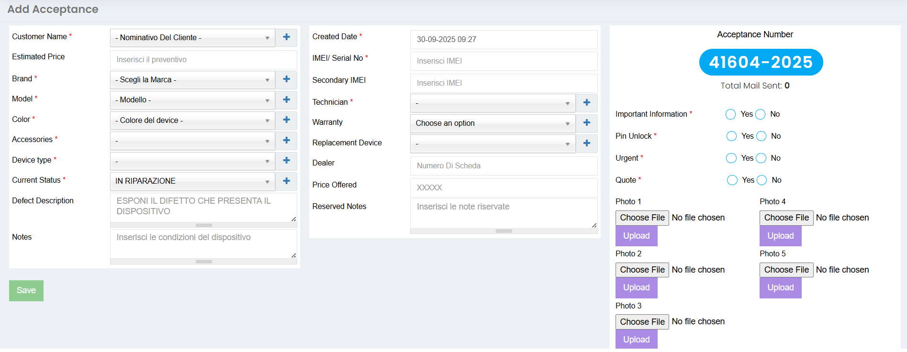

#### 🟦 1. Basic Information
| Field | Description |
| :--- | :--- |
| **Page ID:** | `P-001` |
| **Page Name:** | Add Acceptance |
| **Page Type:** | Create Form |
| **Page URL:** | `/en/frontdesk/acceptance/add` |
| **Purpose:** | To create a new repair job record when a customer brings in a device. This is the starting point of the entire repair workflow. |
| **Accessible by:**| Technician, FrontDesk Executive, Manager, Admin |

---
#### 🟧 2. Input Fields
| # | Label | Field Name | Type | Required | Default | Behavior / Notes |
| :--- | :--- | :--- | :--- | :--- | :--- | :--- |
| 1 | **Customer Name** | `customer_name` | Searchable Dropdown | Yes | - | Links to `Customers`. `+` button opens a modal to add a new customer. |
| 2 | **Estimated Price** | `estimated_price` | Number | No | Empty | Manual input. Placeholder: "Enter the estimated price". |
| 3 | **Brand** | `brand` | Searchable Dropdown | Yes | - | Links to `Brands`. `+` button opens a modal to add a new brand. |
| 4 | **Model** | `model` | Searchable Dropdown | Yes | - | Links to `Models`, filtered by selected Brand. `+` button to add a new model. |
| 5 | **Color** | `color` | Searchable Dropdown | No | - | Links to `Colors`. `+` button to add a new color. |
| 6 | **Accessories** | `accessories` | Text Input | No | Empty | Manual input for items like chargers, cases. |
| 7 | **Device Type** | `device_type` | Dropdown | Yes | - | Configurable list (e.g., "SMARTPHONE"). |
| 8 | **Current Status** | `current_status` | Dropdown | Yes | `IN REPAIR` | Configurable list of repair statuses. |
| 9 | **Defect Description**| `defect_description`| Text Area | No | Empty | Placeholder: "Describe the defect presented by the device". |
| 10 | **Notes** | `notes` | Text Area | No | Empty | Placeholder: "Enter the condition of the device". |
| 11 | **Created Date** | `created_date` | Date Picker | Yes | Current Date | Auto-populates. |
| 12 | **IMEI/Serial No** | `imei` | Text Input | Yes | Empty | Placeholder: "Enter IMEI". |
| 13 | **Secondary IMEI** | `secondary_imei` | Text Input | No | Empty | Placeholder: "Enter secondary IMEI". |
| 14 | **Technician** | `technician_id` | Dropdown | Yes | - | Links to `Users` with "Technician" role. `+` button to add a new user. |
| 15 | **Warranty** | `warranty` | Dropdown | No | `Choose an option` | Configurable list. `+` button to add new options. |
| 16 | **Replacement Device**|`replacement_device`| Text Input | No | Empty | Records details of a loaner device. |
| 17 | **Dealer** | `dealer` | Text Input | No | Empty | For B2B partner reference. |
| 18 | **Price Offered** | `price_offered` | Number | No | `XXXXX` | Price to buy the device from the customer (trade-in). |
| 19 | **Reserved Notes** | `reserved_notes` | Text Area | No | Empty | Placeholder: "Enter reserved notes". |
| 20 | **Important Information**|`important_information`| Radio (Yes/No) | Yes | No | Flag for critical notes. |
| 21 | **Pin Unlock** | `pin_unlock` | Radio (Yes/No) | Yes | No | Indicates if the device PIN is provided. |
| 22 | **Pin Unlock Number**| `pin_unlock_number` | Text Input | No | Hidden | **Hidden by default.** Becomes visible only if "Pin Unlock" is set to "Yes". |
| 23 | **Urgent** | `urgent` | Radio (Yes/No) | Yes | No | Marks the job as high priority. |
| 24 | **Urgent Date** | `urgent_date` | Date Picker | No | Hidden | **Hidden by default.** Becomes visible only if "Urgent" is set to "Yes". |
| 25 | **Quote** | `quote` | Radio (Yes/No) | Yes | No | Indicates if a formal quote is needed before repair. |
| 26 | **Photo 1** | `photo_1` | File Upload | No | - | For uploading an image of the device. |
| 27 | **Photo 2** | `photo_2` | File Upload | No | - | For uploading an image of the device. |
| 28 | **Photo 3** | `photo_3` | File Upload | No | - | For uploading an image of the device. |
| 29 | **Photo 4** | `photo_4` | File Upload | No | - | For uploading an image of the device. |
| 30 | **Photo 5** | `photo_5` | File Upload | No | - | For uploading an image of the device. |

---
#### 🟩 4. Buttons & Actions
| Button Name | Type | Function / Behavior |
| :--- | :--- | :--- |
| **Save** | Submit | Validates the form. On success, creates a new `Job` record and redirects to the Edit Acceptance page. |

---
#### 🟦 5. Expected Outputs
1.  A new **Job (Acceptance)** record is created in the database.
2.  An **Acceptance Number** (e.g., `41604-2025`) is generated and prominently displayed on the next page.
3.  The user is redirected to the **Edit Acceptance** page for the newly created job.

---
#### 🟪 6. Validation Rules
| Field | Rule / Description | Error Message (Implied) |
| :--- | :--- | :--- |
| `customer_name` | Must not be empty. | This field is required. |
| `brand` | Must not be empty. | This field is required. |
| `model` | Must not be empty. | This field is required. |
| `imei`| Must not be empty. | This field is required. |
| `technician_id` | Must not be empty. | This field is required. |

---
#### 🟫 7. Workflow
1.  User clicks **Acceptances > Acceptance (Add New)** from the main menu.
2.  The user fills in the form with all required customer and device details.
3.  The user clicks the **"Save"** button.
4.  The system validates required fields. Upon success, it creates the record and redirects the user to the "Edit Acceptance" page, which now shows the newly generated `Acceptance Number`.

---

---
[Back to Main Navigation Menu](#2-main-navigation-menu)

### Page: Acceptance (Search)
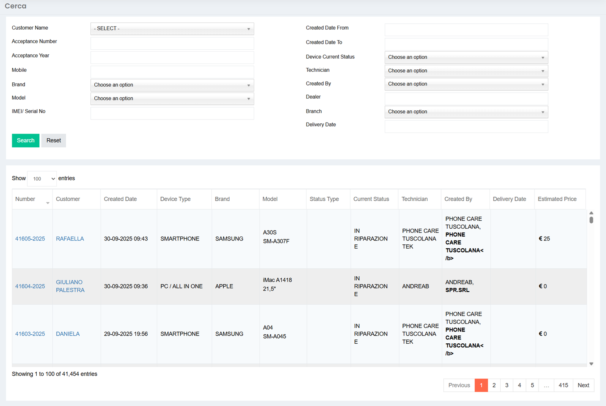

#### 🟦 1. Basic Information
| Field | Description |
| :--- | :--- |
| **Page ID:** | `P-002` |
| **Page Name:** | Search (Cerca) |
| **Page Type:** | Search / List |
| **Page URL:** | `/en/frontdesk/acceptances` |
| **Purpose:** | To provide a powerful, multi-filter interface for finding specific repair jobs based on a wide range of criteria. |
| **Accessible by:**| Technician, FrontDesk Executive, Manager, Admin |

---
#### 🟨 3. Filters / Search
This page is dominated by a comprehensive search form.

| Label | Field Name | Type | Logic | Notes |
| :--- | :--- | :--- | :--- | :--- |
| **Customer Name** | `customer_name` | Searchable Dropdown | Exact Match | Searches from the `Customers` table. |
| **Acceptance Number**| `acceptance_number` | Text Input | Contains | Searches for a partial or full acceptance number. |
| **Acceptance Year** | `acceptance_year` | Text Input | Exact Match | Filters jobs created in a specific year. |
| **Mobile** | `mobile` | Text Input | Contains | Searches by customer's mobile number. |
| **Brand** | `brand` | Dropdown | Exact Match | Filters by device brand. |
| **Model** | `model` | Dropdown | Exact Match | Filters by device model. |
| **IMEI/Serial No** | `imei` | Text Input | Contains | Searches by the device's IMEI or serial number. |
| **Created Date From**| `created_date_from` | Date Picker | Greater than or equal to | Sets the start of a date range for when the job was created. |
| **Created Date To** | `created_date_to` | Date Picker | Less than or equal to | Sets the end of a date range. |
| **Device Current Status**| `current_status` | Dropdown | Exact Match | Filters by the current repair status. |
| **Technician** | `technician` | Dropdown | Exact Match | Filters by the assigned technician. |
| **Created By** | `created_by` | Dropdown | Exact Match | Filters by the user who created the job record. |
| **Dealer** | `dealer` | Dropdown | Exact Match | Filters by the associated dealer. |
| **Branch** | `branch` | Dropdown | Exact Match | Filters by the branch where the job was created. |
| **Delivery Date** | `delivery_date` | Date Picker | Exact Match | Filters by the date the device was returned to the customer. |

---
#### 🟩 4. Buttons & Actions
| Button Name | Type | Function / Behavior |
| :--- | :--- | :--- |
| **Search** | Submit Button | Executes the search query using the provided filter criteria and updates the results table below. |
| **Reset** | Reset Button | Clears all the filter fields to their default state. |

---
#### 🟦 5. Expected Outputs
* The primary output is a paginated data table displaying the repair jobs that match the filter criteria.
* The table shows a summary of the total number of entries found (e.g., "Showing 1 to 100 of 41,454 entries").

**Table Columns**
| Column Header | Data Source | Notes |
| :--- | :--- | :--- |
| **Number** | `acceptanceNumber` | Links to the "Edit Acceptance" page for that job. |
| **Customer** | `customer.name` | Links to the customer's details page. |
| **Created Date**| `createdDate` | |
| **Device Type**| `deviceType` | |
| **Brand** | `brand.name` | |
| **Model** | `model.name` | |
| **Status Type**| `statusType` | |
| **Current Status**| `currentStatus` | |
| **Technician** | `technician.name` | |
| **Created By** | `createdBy.name` & `branch.name` | |
| **Delivery Date**| `deliveryDate` | |
| **Estimated Price**| `estimatedPrice` | |

---
#### 🟫 7. Workflow
1.  User navigates to the **Acceptances > Search** page.
2.  User enters values into one or more filter fields.
3.  User clicks the **"Search"** button.
4.  The data table below the form reloads, displaying only the records that match the search criteria.
5.  User can click on an `Acceptance Number` or `Customer` in the results to navigate to their respective details pages.
6.  User can use the pagination controls at the bottom to navigate through multiple pages of results.

---

---
[Back to Main Navigation Menu](#2-main-navigation-menu)

### Page: Acceptance List
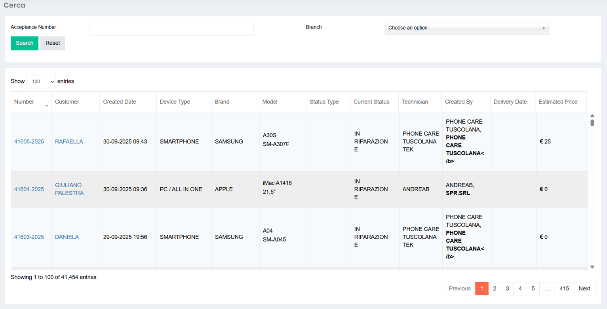

#### 🟦 1. Basic Information
| Field | Description |
| :--- | :--- |
| **Page ID:** | `P-003` |
| **Page Name:** | Acceptance List |
| **Page Type:** | Search / List |
| **Page URL:** | `/en/frontdesk/acceptances/list-only` |
| **Purpose:** | To provide a simplified, quick-access view of all repair jobs with minimal filtering. |
| **Accessible by:**| Technician, FrontDesk Executive, Manager, Admin |

---
#### 🟨 3. Filters / Search
This page provides a simplified search interface compared to the main "Search" page.

| Label | Field Name | Type | Logic | Notes |
| :--- | :--- | :--- | :--- | :--- |
| **Acceptance Number**| `acceptance_number` | Text Input | Contains | Searches for a partial or full acceptance number. |
| **Branch** | `branch` | Dropdown | Exact Match | Filters by the branch where the job was created. |

---
#### 🟩 4. Buttons & Actions
| Button Name | Type | Function / Behavior |
| :--- | :--- | :--- |
| **Search** | Submit Button | Executes the search query using the provided filter criteria and updates the results table below. |
| **Reset** | Reset Button | Clears all the filter fields to their default state. |

---
#### 🟦 5. Expected Outputs
* The primary output is a paginated data table displaying the repair jobs that match the filter criteria.
* The table shows a summary of the total number of entries found (e.g., "Showing 1 to 100 of 41,454 entries").

**Table Columns**
| Column Header | Data Source | Notes |
| :--- | :--- | :--- |
| **Number** | `acceptanceNumber` | Links to the "Edit Acceptance" page for that job. |
| **Customer** | `customer.name` | Links to the customer's details page. |
| **Created Date**| `createdDate` | |
| **Device Type**| `deviceType` | |
| **Brand** | `brand.name` | |
| **Model** | `model.name` | |
| **Status Type**| `statusType` | |
| **Current Status**| `currentStatus` | |
| **Technician** | `technician.name` | |
| **Created By** | `createdBy.name` & `branch.name` | |
| **Delivery Date**| `deliveryDate` | |
| **Estimated Price**| `estimatedPrice` | |

---
#### 🟫 7. Workflow
1.  User navigates to the **Acceptances > Acceptance List** page.
2.  Optionally, the user enters an `Acceptance Number` or selects a `Branch` to filter the results.
3.  The user clicks the **"Search"** button.
4.  The data table updates to show only the matching records.
5.  User can click on an `Acceptance Number` in the results to navigate to the "Edit Acceptance" page.

---

---
[Back to Main Navigation Menu](#2-main-navigation-menu)

### Page: Acceptance Profit/Loss

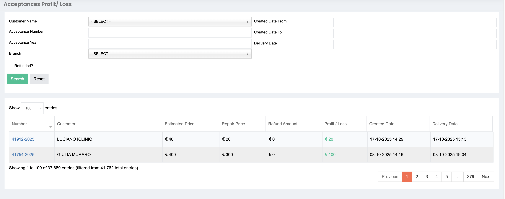

#### 🟦 1. Basic Information
| Field | Description |
| :--- | :--- |
| **Page ID:** | `P-004` |
| **Page Name:** | Acceptances Profit/Loss |
| **Page Type:** | Report / List |
| **Page URL:** | `/en/frontdesk/acceptances/profit-loss` |
| **Purpose:** | To provide a financial report that calculates the profit or loss for each completed repair job based on various cost and revenue fields. |
| **Accessible by:**| Manager, Admin |

---
#### 🟨 3. Filters / Search
This page provides a set of filters to generate a specific profit/loss report.

| Label | Field Name | Type | Logic | Notes |
| :--- | :--- | :--- | :--- | :--- |
| **Customer Name** | `customer_uid` | Searchable Dropdown | Exact Match | Filters by the customer associated with the jobs. |
| **Acceptance Number**| `acceptance_id` | Text Input | Contains | Filters by a specific repair job number. |
| **Acceptance Year** | `id_year` | Text Input | Exact Match | Filters jobs from a specific year. |
| **Branch** | `branch_tid` | Dropdown | Exact Match | Filters jobs belonging to a specific branch. |
| **Refunded?** | `refund` | Checkbox | Boolean Match | Filters to show only jobs that have been refunded. |
| **Created Date From**| `created_date_start`| Date Picker | Greater than or equal to | Sets the start of a creation date range. |
| **Created Date To** | `created_date_end` | Date Picker | Less than or equal to | Sets the end of a creation date range. |
| **Delivery Date** | `delivery_date` | Date Picker | Exact Match | Filters by the exact date the device was delivered. |

---
#### 🟩 4. Buttons & Actions
| Button Name | Type | Function / Behavior |
| :--- | :--- | :--- |
| **Search** | Submit Button | Executes the query with the specified filters and populates the results table. |
| **Reset** | Reset Button | Clears all filter fields. |

---
#### 🟦 5. Expected Outputs
* A paginated data table showing the financial breakdown of each repair job matching the filter criteria.
* The "Profit / Loss" column is color-coded: green for profit, red for loss.

**Table Columns**
| Column Header | Data Source | Notes |
| :--- | :--- | :--- |
| **Number** | `acceptanceNumber` | Links to the "Edit Acceptance" page. |
| **Customer** | `customer.name` | The name of the customer. |
| **Estimated Price**| `estimatedPrice` | The price quoted to the customer. |
| **Repair Price**| `estimatedRepairPrice` | The internal cost or final price of the repair. |
| **Refund Amount**| `refundAmount` | The amount refunded to the customer. |
| **Profit / Loss**| Calculated Field | `Estimated Price` - `Repair Price` - `Refund Amount`. |
| **Created Date**| `createdDate` | Timestamp of job creation. |
| **Delivery Date**| `deliveryDate` | Timestamp of device delivery to the customer. |

---
#### 🟫 7. Workflow
1.  User navigates to the **Acceptances > Acceptance Profit/Loss** page.
2.  User applies one or more filters to narrow down the report (e.g., a date range and a specific branch).
3.  User clicks the **"Search"** button.
4.  The system calculates the profit/loss for each relevant job and displays the results in the table.

---
#### ⚙️ 11. Backend Instruction / Guide
* The backend needs to perform a query on the `jobs` table based on the provided filters.
* For each returned record, it must calculate the `Profit / Loss` value. The formula appears to be `estimated_price - repair_price - refund_amount`.
* The results should be paginated.

---

---
[Back to Main Navigation Menu](#2-main-navigation-menu)

### Page: Deleted Acceptance

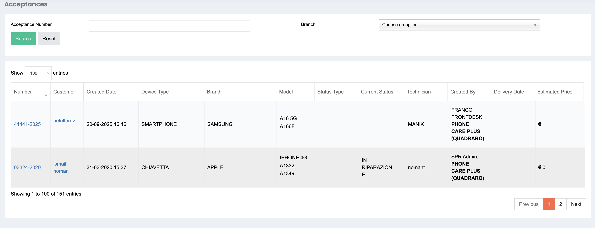

#### 🟦 1. Basic Information
| Field | Description |
| :--- | :--- |
| **Page ID:** | `P-005` |
| **Page Name:** | Deleted Acceptances |
| **Page Type:** | Search / List |
| **Page URL:** | `/en/frontdesk/deleted-acceptances` |
| **Purpose:** | To provide a view for administrators or managers to review repair jobs that have been deleted from the main system, likely for auditing or potential restoration. |
| **Accessible by:**| Manager, Admin |

---
#### 🟨 3. Filters / Search
This page provides a simple search interface to find specific deleted records.

| Label | Field Name | Type | Logic | Notes |
| :--- | :--- | :--- | :--- | :--- |
| **Acceptance Number**| `acceptance_id` | Text Input | Contains | Searches for a partial or full acceptance number among deleted records. |
| **Branch** | `branch_tid` | Dropdown | Exact Match | Filters deleted jobs by the branch where they were created. |

---
#### 🟩 4. Buttons & Actions
| Button Name | Type | Function / Behavior |
| :--- | :--- | :--- |
| **Search** | Submit Button | Executes the search query using the provided filter criteria and updates the results table below. |
| **Reset** | Reset Button | Clears all the filter fields to their default state. |

---
#### 🟦 5. Expected Outputs
* A paginated data table displaying the deleted repair jobs that match the filter criteria.
* The table shows a summary of the total number of entries found (e.g., "Showing 1 to 100 of 151 entries").

**Table Columns**
| Column Header | Data Source | Notes |
| :--- | :--- | :--- |
| **Number** | `acceptanceNumber` | Links to the "Edit Acceptance" page, likely allowing for viewing or restoring the job. |
| **Customer** | `customer.name` | The name of the customer associated with the deleted job. |
| **Created Date**| `createdDate` | |
| **Device Type**| `deviceType` | |
| **Brand** | `brand.name` | |
| **Model** | `model.name` | |
| **Status Type**| `statusType` | |
| **Current Status**| `currentStatus` | |
| **Technician** | `technician.name` | |
| **Created By** | `createdBy.name` & `branch.name` | |
| **Delivery Date**| `deliveryDate` | |
| **Estimated Price**| `estimatedPrice` | |

---
#### 🟫 7. Workflow
1.  User navigates to the **Acceptances > Deleted Acceptance** page.
2.  Optionally, the user enters an `Acceptance Number` or selects a `Branch` to find a specific deleted record.
3.  The user clicks the **"Search"** button.
4.  The data table updates to show only the matching deleted records.

---
#### ⚙️ 11. Backend Instruction / Guide
* The backend query for this page should target the `jobs` table and filter for records where a `is_deleted` flag is set to `true` (or a similar mechanism for soft deletion).
* The search functionality should apply additional filters on top of the `is_deleted = true` condition.
* Clicking the "Number" link for a deleted job might lead to a read-only view or a view with an "Undelete/Restore" button.

---

---
[Back to Main Navigation Menu](#2-main-navigation-menu)

### Page: Acceptance Generate Refund

#### 🟦 1. Basic Information
| Field | Description |
| :--- | :--- |
| **Page ID:** | `P-006` |
| **Page Name:** | Acceptance Generate Refund |
| **Page Type:** | Action Form / Utility |
| **Page URL:** | `/en/frontdesk/acceptance/refund` |
| **Purpose:** | To initiate and record a refund for a previously created repair job by linking it to an Acceptance ID. |
| **Accessible by:**| Manager, Admin |
| **Note:** | The on-screen title is "Generate Indent Card", but the functionality relates to refunds. |

---
#### 🟧 2. Input Fields
| # | Label | Field Name | Type | Required | Default | Behavior / Notes |
| :--- | :--- | :--- | :--- | :--- | :--- | :--- |
| 1 | **Acceptance ID** | `existing_acceptance_id` | Text Input | Yes | Empty | User must enter the exact `acceptanceNumber` of the job to be refunded. |
| 2 | **Current Defect** | `notes` | Text Area | No | Empty | A field for entering the reason for the refund or any other relevant notes. |

---
#### 🟩 4. Buttons & Actions
| Button Name | Type | Function / Behavior |
| :--- | :--- | :--- |
| **Submit** | Submit Button | Validates the Acceptance ID. On success, it likely processes a refund transaction and updates the original job record. |
| **Reset** | Reset Button | Clears the `Acceptance ID` and `Current Defect` fields. |

---
#### 🟦 5. Expected Outputs
1.  A new `Transaction` record is created with a `type` of "Refund" and a value in the `expense` column.
2.  The `refundAmount` field on the corresponding `Job` record is updated.
3.  A success message is displayed to the user confirming the refund has been processed.

---
#### 🟪 6. Validation Rules
| Field | Rule / Description | Error Message (Implied) |
| :--- | :--- | :--- |
| `existing_acceptance_id` | Must not be empty. | This field is required. |
| `existing_acceptance_id` | The ID entered must correspond to an existing record in the `jobs` table. | "Acceptance ID not found." |

---
#### 🟫 7. Workflow
1.  User navigates to the **Acceptances > Acceptance Generate Refund** page.
2.  User enters the `Acceptance ID` of the job that needs a refund.
3.  User optionally enters a reason for the refund in the "Current Defect" text area.
4.  User clicks the **"Submit"** button.
5.  The system validates the ID, creates a negative transaction in the financial ledger, updates the original job record, and displays a confirmation message.

---

---
[Back to Main Navigation Menu](#2-main-navigation-menu)

## 4. Module: Sale/ Order System

This module covers all workflows related to selling items, including sales of non-inventoried goods, e-commerce orders, and ordering spare parts.

### Page: Add General Sale

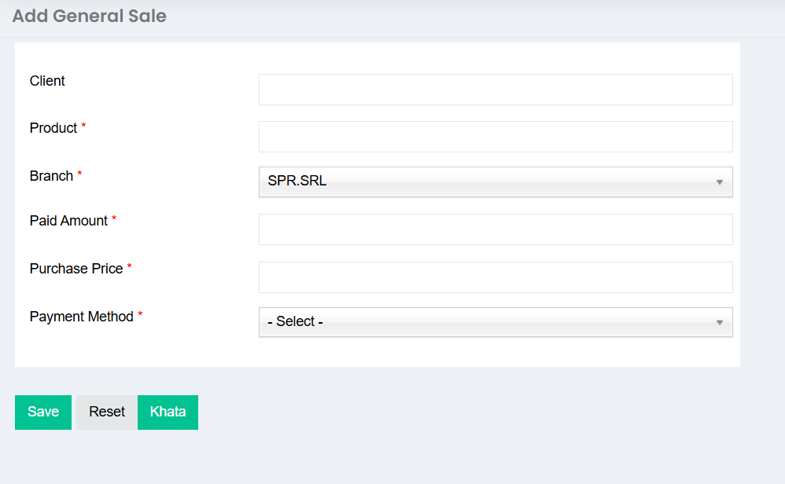

#### 🟦 1. Basic Information
| Field | Description |
| :--- | :--- |
| **Page ID:** | `P-007` |
| **Page Name:** | Add General Sale |
| **Page Type:** | Create Form |
| **Page URL:** | `/en/frontdesk/general-sales/add` |
| **Purpose:** | To record a simple sale for a non-inventoried item or a general service where detailed product tracking is not required. |
| **Accessible by:**| FrontDesk Executive, Manager, Admin |

---
#### 🟧 2. Input Fields
| # | Label | Field Name | Type | Required | Default | Behavior / Notes |
| :--- | :--- | :--- | :--- | :--- | :--- | :--- |
| 1 | **Client** | `client` | Text Input | No | Empty | A free-text field for the client's name. It does not appear to be linked to the main `Customers` table. |
| 2 | **Product** | `product` | Text Input | Yes | Empty | A free-text description of the item or service being sold. |
| 3 | **Branch** | `branch` | Dropdown | Yes | Pre-selected | The branch where the sale is taking place. It seems to default to the user's current branch. |
| 4 | **Paid Amount** | `paid_amount` | Number | Yes | Empty | The amount of money received from the client for this sale. |
| 5 | **Purchase Price** | `purchase_price` | Number | Yes | Empty | The cost of the item/service being sold, used to calculate profit. |
| 6 | **Payment Method** | `payment_method` | Dropdown | Yes | `- Select -` | A list of payment methods (e.g., Cash, Card). |

---
#### 🟩 4. Buttons & Actions
| Button Name | Type | Function / Behavior |
| :--- | :--- | :--- |
| **Save** | Submit | Validates the form. On success, creates a new `General Sale` record and likely a corresponding financial `Transaction`. |
| **Reset** | Reset | Clears all input fields on the form. |
| **Khata** | Submit & Redirect | Saves the form and then redirects the user to the "Khata Online" financial report page. |

---
#### 🟦 5. Expected Outputs
1.  A new **General Sale** record is created in the database.
2.  A new **Transaction** record is created in the financial ledger, logging the `Paid Amount` as income and the `Purchase Price` as an expense.
3.  The user is shown a success message. If "Khata" was clicked, they are redirected.

---
#### 🟪 6. Validation Rules
| Field | Rule / Description | Error Message (Implied) |
| :--- | :--- | :--- |
| `Product` | Must not be empty. | This field is required. |
| `Paid Amount` | Must not be empty and must be a valid number. | This field is required. |
| `Purchase Price`| Must not be empty and must be a valid number. | This field is required. |
| `Payment Method`| Must be selected. | This field is required. |

---
#### 🟫 7. Workflow
1.  User navigates to **Sale/ Order System > Add General Sale**.
2.  User fills in the details of the sale, including what was sold and how much was paid.
3.  User clicks **"Save"** to record the sale or **"Khata"** to save and view the financial report.
4.  The system creates the necessary records and provides feedback.

---

---
[Back to Main Navigation Menu](#2-main-navigation-menu)

### Page: Add E-Commerce Sale

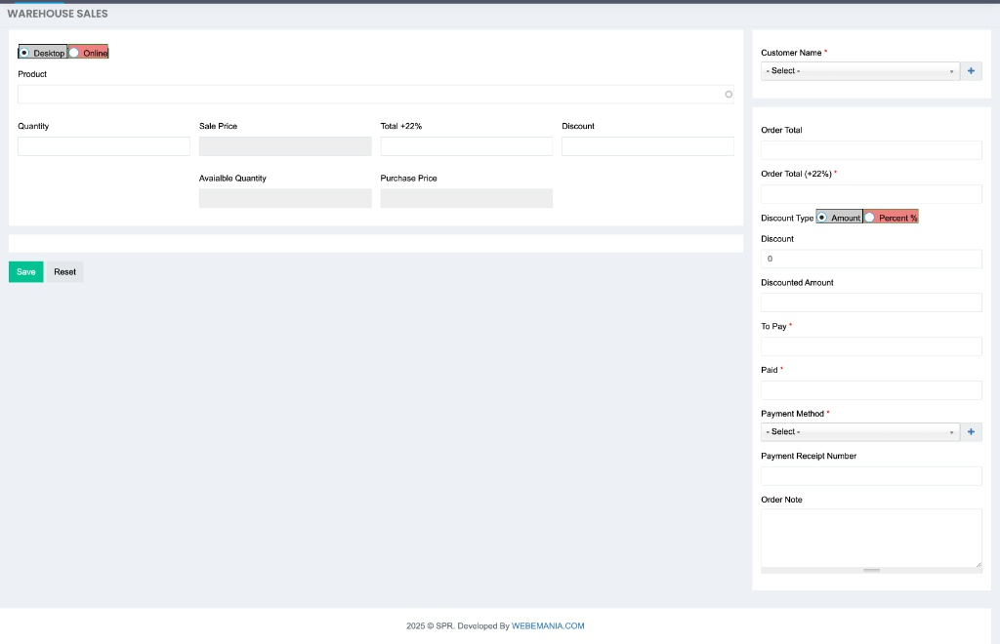

#### 🟦 1. Basic Information
| Field | Description |
| :--- | :--- |
| **Page ID:** | `P-008` |
| **Page Name:** | Add E-Commerce Sale (Back Office) |
| **Page Type:** | Create Form / Point of Sale |
| **Page URL:** | `/en/frontdesk/backoffice-orders/add` |
| **Purpose:** | To allow staff to create an e-commerce or warehouse sale on behalf of a customer, selecting from existing product inventory. |
| **Accessible by:**| FrontDesk Executive, Manager, Admin |
| **Note:** | The on-screen title is "WAREHOUSE SALES". |

---
#### 🟧 2. Input Fields
This page is divided into two main sections: a product entry/cart section on the left, and an order finalization section on the right.

**Part A: Product Entry Section**
| # | Label | Field Name | Type | Required | Default | Behavior / Notes |
| :--- | :--- | :--- | :--- | :--- | :--- | :--- |
| 1 | **Price Type** | `price_type` | Radio Buttons | Yes | `Desktop` | Toggles between using the "Desktop Price" (`value=0`) or "Online Price" (`value=1`) from the product record. |
| 2 | **Product** | `product` | Autocomplete Text | Yes (for each item) | Empty | User searches for a product by name or SKU. Selecting a product populates the read-only fields below. |
| 3 | **Quantity** | `quantity` | Number | Yes (for each item) | Empty | The number of units of the selected product to add to the cart. |
| 4 | **Sale Price** | `online_price` | Number (Read-only) | - | - | Auto-populates with the product's price based on the selected `Price Type`. |
| 5 | **Total +22%** | `price` | Number (Read-only) | - | - | Auto-calculates the total price for the line item including tax. `(Sale Price * Quantity) * 1.22`. |
| 6 | **Discount** | `product_discount` | Number | No | Empty | A discount to be applied to this specific line item only. |
| 7 | **Available Quantity**| `available_quantity`| Number (Read-only) | - | - | Shows the current stock level for the selected product. |
| 8 | **Purchase Price** | `purchase_price` | Number (Read-only) | - | - | Shows the cost of the product for internal reference. |

**Part B: Order & Payment Section**
| # | Label | Field Name | Type | Required | Default | Behavior / Notes |
| :--- | :--- | :--- | :--- | :--- | :--- | :--- |
| 9 | **Customer Name** | `customer_uid` | Searchable Dropdown | Yes | `- Select -` | Links to `Customers`. `+` button opens a modal to add a new customer. |
| 10 | **Order Total** | `order_total_wt_tax`| Number (Read-only) | - | - | The sum of all line item totals before tax and discounts. |
| 11 | **Order Total (+22%)**| `order_total` | Number (Read-only) | Yes | - | The sum of all line item `Total +22%` values. |
| 12 | **Discount Type** | `order_tax` | Radio Buttons | Yes | `Amount` | Toggles whether the `Discount` field represents a fixed amount or a percentage. |
| 13 | **Discount** | `discount` | Number | No | `0` | The value of the overall order discount. |
| 14 | **Discounted Amount**| `discounted_amount`| Number (Read-only) | - | - | The calculated total discount in currency. |
| 15 | **To Pay** | `total_amount` | Number (Read-only) | Yes | - | The final amount due after all discounts. |
| 16 | **Paid** | `total_paid` | Number | Yes | Empty | The amount the customer is paying now. |
| 17 | **Payment Method** | `payment_method_tid`| Dropdown | Yes | `- Select -` | Configurable list of payment methods. `+` button opens a modal to add a new method. |
| 18 | **Payment Receipt Number**| `payment_method_receipt_number` | Text Input | No | Empty | A reference number for the payment (e.g., transaction ID). |
| 19 | **Order Note** | `note` | Text Area | No | Empty | General notes about the entire order. |

---
#### 🟩 4. Buttons & Actions
| Button Name | Type | Function / Behavior |
| :--- | :--- | :--- |
| **Add Product** | Button | Adds the product configured in the "Product Entry Section" to the order cart/list. This updates the totals in the right-hand column. |
| **Remove Product**| Button | (Visible after adding a product) Removes a selected item from the order cart/list. |
| **Save** | Submit | Validates and finalizes the entire order, including all items in the cart and payment details. |
| **Reset** | Reset | Clears all fields and the product cart. |

---
#### 🟦 5. Expected Outputs
1.  A new **Sale** record is created containing all order details and line items.
2.  A corresponding **Transaction** is created in the financial ledger for the `Paid` amount.
3.  The `stock` for each product sold is decremented by the `Quantity` sold.
4.  A success message is displayed, and an invoice may be generated.

---
#### 🟫 7. Workflow
1.  User navigates to **Sale/ Order System > Back Office E-Commerce Sale > Add E-Commerce Sale**.
2.  In the right column, the user selects the **Customer Name**.
3.  In the left column, the user selects a **Price Type** (Desktop or Online).
4.  User searches for a **Product**, enters a **Quantity** and optional line-item **Discount**, and clicks **"Add Product"**.
5.  The product appears in a list (the "cart"), and the order totals on the right are updated.
6.  The user repeats steps 4-5 for all products being sold.
7.  The user fills out the final payment details on the right: `Discount`, `Paid` amount, `Payment Method`, etc.
8.  The user clicks **"Save"** to complete the transaction.

---

---
[Back to Main Navigation Menu](#2-main-navigation-menu)

### Page: Back Office E-Commerce Sale List

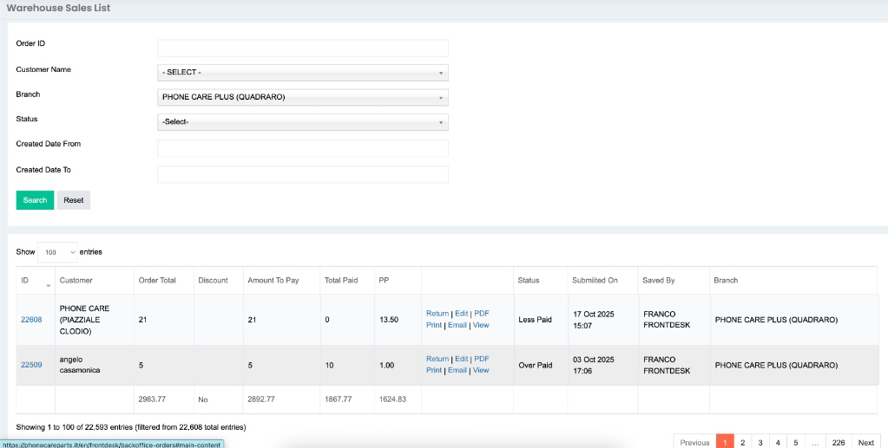

#### 🟦 1. Basic Information
| Field | Description |
| :--- | :--- |
| **Page ID:** | `P-009` |
| **Page Name:** | Back Office E-Commerce Sale List |
| **Page Type:** | Search / List |
| **Page URL:** | `/en/frontdesk/backoffice-orders` |
| **Purpose:** | To view, search, and manage a list of all sales created through the back-office POS system ("Warehouse Sales"). |
| **Accessible by:**| FrontDesk Executive, Manager, Admin |
| **Note:** | The on-screen title is "Warehouse Sales List". |

---
#### 🟨 3. Filters / Search
| Label | Field Name | Type | Logic | Notes |
| :--- | :--- | :--- | :--- | :--- |
| **Order ID** | `id` | Text Input | Exact Match | Filters by the unique sale ID. |
| **Customer Name** | `customer_uid` | Dropdown | Exact Match | Filters by the customer who made the purchase. |
| **Branch** | `branch_tid` | Dropdown | Exact Match | Filters by the branch where the sale was recorded. |
| **Status** | `backoffice_order_tid` | Dropdown | Exact Match | Filters by the payment status of the sale (e.g., "Less Paid", "Over Paid"). |
| **Created Date From**| `created_date_start`| Date Picker | Greater than or equal to | Sets the start of a creation date range. |
| **Created Date To** | `created_date_end` | Date Picker | Less than or equal to | Sets the end of a creation date range. |

---
#### 🟩 4. Buttons & Actions
| Button Name | Type | Function / Behavior |
| :--- | :--- | :--- |
| **Search** | Submit Button | Executes the search query using the provided filter criteria and updates the results table. |
| **Reset** | Reset Button | Clears all the filter fields. |

---
#### 🟦 5. Expected Outputs
* A paginated data table showing all back-office sales that match the filter criteria.
* A summary of the total number of entries found is displayed.

**Table Columns**
| Column Header | Data Source | Notes |
| :--- | :--- | :--- |
| **ID** | `id` | The unique sale ID. Links to an edit/details page. |
| **Customer** | `customer.name` | The name of the customer. |
| **Order Total** | `orderTotal` | The total value of the order before discounts. |
| **Discount** | `discount` | The discount applied to the order. |
| **Amount To Pay** | `toPay` | The final amount due after discounts. |
| **Total Paid** | `paid` | The actual amount paid by the customer. |
| **PP** | `purchasePrice` | The total purchase price (cost) of the items in the sale. |
| **Status** | `status` | The payment status of the order (e.g., "Less Paid", "Over Paid"). |
| **Submitted On** | `createdDate` | The date and time the order was created. |
| **Saved By** | `user.name` | The user who processed the sale. |
| **Branch** | `branch.name` | The branch where the sale was processed. |
| **(Actions)** | - | A column with links for `Return`, `Edit`, `PDF`, `Print`, `Email`, `View`. |

---
#### 🟫 7. Workflow
1.  User navigates to **Sale/ Order System > Back Office E-Commerce Sale > Back Office E-Commerce Sale List**.
2.  The page loads with a list of recent sales.
3.  User can apply filters at the top to find specific sales.
4.  User clicks the **"Search"** button to apply the filters.
5.  The table updates to show the filtered results.
6.  User can click on action links (`Edit`, `View`, `PDF`, etc.) for any specific order in the list.

---

---
[Back to Main Navigation Menu](#2-main-navigation-menu)

### Page: Submit Order Parts

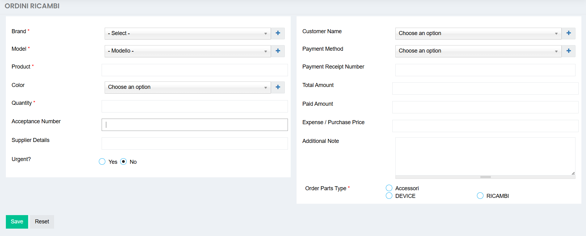

#### 🟦 1. Basic Information
| Field | Description |
| :--- | :--- |
| **Page ID:** | `P-010` |
| **Page Name:** | Submit Order Parts |
| **Page Type:** | Create Form |
| **Page URL:** | `/en/frontdesk/order-parts/add` |
| **Purpose:** | To create a record for a spare part that needs to be ordered from a supplier, which can optionally be linked to a specific customer or repair job. |
| **Accessible by:**| Technician, FrontDesk Executive, Manager, Admin |

---
#### 🟧 2. Input Fields
| # | Label | Field Name | Type | Required | Default | Behavior / Notes |
| :--- | :--- | :--- | :--- | :--- | :--- | :--- |
| 1 | **Brand** | `brand` | Searchable Dropdown | Yes | `- Choose a Brand -` | Links to `Brands`. `+` button opens a modal to add a new brand. |
| 2 | **Model** | `model` | Searchable Dropdown | Yes | `- Model -` | Links to `Models`, filtered by selected Brand. `+` button to add a new model. |
| 3 | **Product** | `product` | Text Input | Yes | Empty | A description of the spare part being ordered. |
| 4 | **Color** | `color` | Dropdown | No | `- Choose an option -` | Links to `Colors`. `+` button to add a new color. |
| 5 | **Quantity** | `quantity` | Number | Yes | Empty | |
| 6 | **Acceptance Number**| `acceptance_number` | Text Input | No | Empty | Links this part order to an existing repair job. |
| 7 | **Supplier Details**| `supplier_details` | Text Input | No | Empty | Free-text field for supplier name or contact info. |
| 8 | **Urgent?** | `urgent` | Radio (Yes/No) | No | No | Marks the order as high priority. |
| 9 | **Customer Name** | `customer_name` | Searchable Dropdown | No | `- Choose an option -` | Links to `Customers`. `+` button opens a modal to add a new customer. |
| 10 | **Payment Method** | `payment_method` | Dropdown | No | `- Choose an option -` | Links to `Payment Methods`. `+` button opens a modal to add a new method. |
| 11 | **Payment Receipt Number**|`receipt_number` | Text Input | No | Empty | A reference for the payment transaction. |
| 12 | **Total Amount** | `total_amount` | Number | No | Empty | The total sale price of the part to the customer. |
| 13 | **Paid Amount** | `paid_amount` | Number | No | Empty | The amount the customer has paid upfront. |
| 14 | **Expense / Purchase Price** | `purchase_price` | Number | No | Empty | The cost to purchase the part from the supplier. |
| 15 | **Additional Note** | `note` | Text Area | No | Empty | General notes about the part order. |
| 16 | **Order Parts Type**| `order_type` | Radio Buttons | Yes | `RICAMBI` (Spare Parts) | Defines the type of item: `Accessori` (Accessories), `DEVICE`, or `RICAMBI` (Spare Parts). |

---
#### 🟩 4. Buttons & Actions
| Button Name | Type | Function / Behavior |
| :--- | :--- | :--- |
| **Save** | Submit | Validates the form and creates a new `Part Order` record. |
| **Reset** | Reset | Clears all input fields on the form. |

---
#### 🟦 5. Expected Outputs
1.  A new **Part Order** record is created in the database.
2.  If `Paid Amount` is greater than zero, a new **Transaction** is created in the financial ledger.
3.  A success message is displayed to the user.

---
#### 🟪 6. Validation Rules
| Field | Rule / Description | Error Message (Implied) |
| :--- | :--- | :--- |
| `Brand` | Must be selected. | This field is required. |
| `Model` | Must be selected. | This field is required. |
| `Product` | Must not be empty. | This field is required. |
| `Quantity`| Must not be empty and must be a number. | This field is required. |

---
#### 🟫 7. Workflow
1.  User navigates to **Sale/ Order System > Order Spare parts > Submit Order Parts**.
2.  User fills in the details of the part needed, including brand, model, and quantity.
3.  Optionally, the user links the order to an `Acceptance Number` and/or `Customer`.
4.  If the customer is paying upfront, the user fills in the payment details (`Paid Amount`, `Payment Method`, etc.).
5.  User clicks **"Save"**.
6.  The system creates the order record and any associated financial transaction.

---

---
[Back to Main Navigation Menu](#2-main-navigation-menu)

### Page: List of Order Parts

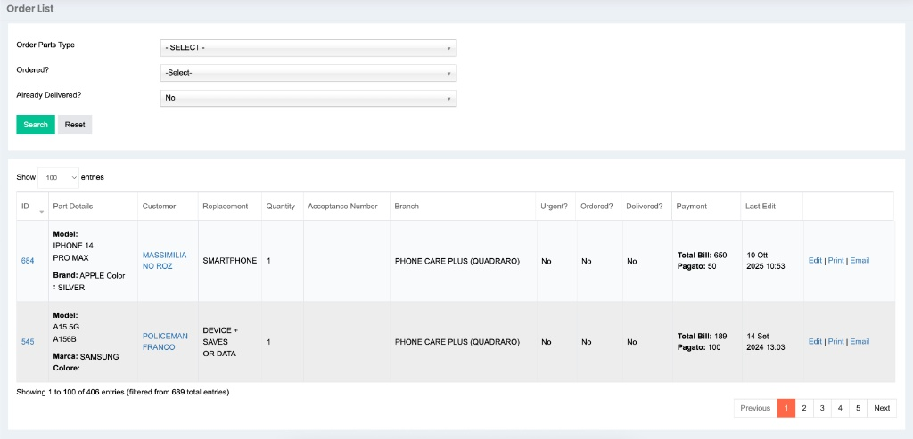

#### 🟦 1. Basic Information
| Field | Description |
| :--- | :--- |
| **Page ID:** | `P-011` |
| **Page Name:** | List of Order Parts |
| **Page Type:** | Search / List |
| **Page URL:** | `/en/frontdesk/order-parts/all` |
| **Purpose:** | To provide a filterable list of all spare part orders, allowing staff to track their status from order to delivery. |
| **Accessible by:**| Technician, FrontDesk Executive, Manager, Admin |
| **Note:** | The on-screen title is "Order List". |

---
#### 🟨 3. Filters / Search
| Label | Field Name | Type | Logic | Notes |
| :--- | :--- | :--- | :--- | :--- |
| **Order Parts Type**| `order_parts_type_tid` | Dropdown | Exact Match | Filters by the type of item ordered (e.g., "SPARE PARTS"). |
| **Ordered?** | `is_ordered` | Dropdown (Yes/No/Select) | Boolean Match | Filters orders based on whether they have been placed with the supplier. |
| **Already Delivered?**| `is_delivered` | Dropdown (Yes/No/Select) | Boolean Match | Filters orders based on whether the parts have been received from the supplier. |

---
#### 🟩 4. Buttons & Actions
| Button Name | Type | Function / Behavior |
| :--- | :--- | :--- |
| **Search** | Submit Button | Executes the search query using the selected filter criteria and updates the results table. |
| **Reset** | Reset Button | Clears all the filter fields to their default state. |

---
#### 🟦 5. Expected Outputs
* A paginated data table displaying the spare part orders that match the filter criteria.
* A summary of the total number of entries found is displayed.

**Table Columns**
| Column Header | Data Source | Notes |
| :--- | :--- | :--- |
| **ID** | `id` | The unique order ID. Links to the edit page for the order. |
| **Part Details** | `model`, `brand`, `color` | A summary of the part being ordered. |
| **Customer** | `customer.name` | Links to the customer's details page. |
| **Replacement** | `productName` | The name or description of the part. |
| **Quantity** | `quantity` | The number of units ordered. |
| **Acceptance Number**| `acceptanceNumber` | Links the order to a specific repair job. |
| **Branch** | `branch.name` | The branch that placed the order. |
| **Urgent?** | `isUrgent` | Displays "Yes" or "No". |
| **Ordered?** | `isOrdered` | Displays "Yes" or "No". |
| **Delivered?** | `isDelivered` | Displays "Yes" or "No". |
| **Payment** | `totalAmount`, `paidAmount` | Shows "Total Bill" and "Paid" amounts. |
| **Last Edit** | `lastEdited` | The timestamp of the last modification to the order. |
| **(Actions)** | - | Links for `Edit`, `Print`, and `Email`. |

---
#### 🟫 7. Workflow
1.  User navigates to **Sale/ Order System > Order Spare parts > List of Order Parts**.
2.  The page loads with a list of recent part orders.
3.  User can select filter criteria such as `Ordered?` or `Delivered?` to track order status.
4.  User clicks the **"Search"** button.
5.  The table updates to show the filtered results.
6.  User can click on an `ID` or `Edit` link to view or modify a specific order.

---

---
[Back to Main Navigation Menu](#2-main-navigation-menu)

### Page: All Online Orders

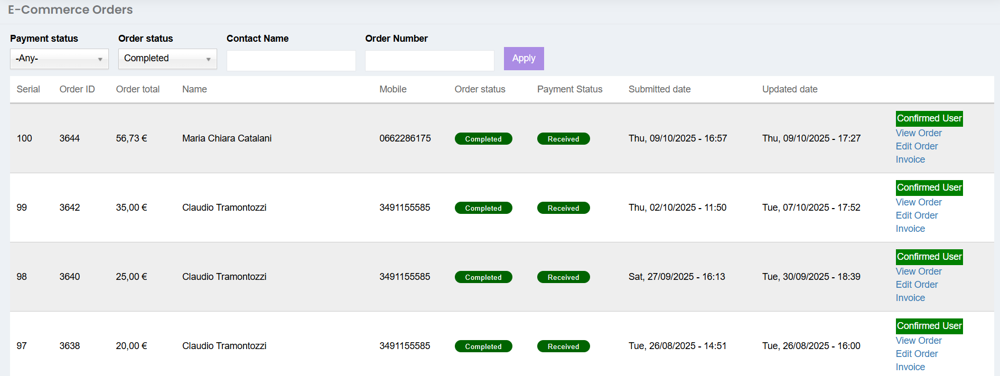

#### 🟦 1. Basic Information
| Field | Description |
| :--- | :--- |
| **Page ID:** | `P-012` |
| **Page Name:** | All Online Orders |
| **Page Type:** | Search / List |
| **Page URL:** | `/en/frontdesk/online-orders` (Assumed) |
| **Purpose:** | To list, filter, and manage all orders originating from the e-commerce website. This page serves as the base view for other filtered lists like "Pending" or "Completed" orders. |
| **Accessible by:**| FrontDesk Executive, Manager, Admin |
| **Note:** | The on-screen title is "E-Commerce Orders". |

---
#### 🟨 3. Filters / Search
| Label | Field Name | Type | Logic | Notes |
| :--- | :--- | :--- | :--- | :--- |
| **Payment status** | `payment_status` (Assumed) | Dropdown | Exact Match | Filters orders by their payment status (e.g., "Any", "Received"). |
| **Order status** | `order_status` (Assumed) | Dropdown | Exact Match | Filters orders by their fulfillment status (e.g., "Any", "Completed"). |
| **Contact Name** | `contact_name` (Assumed) | Text Input | Contains | Searches for orders by the customer's name. |
| **Order Number** | `order_number` (Assumed) | Text Input | Contains | Searches for a specific order by its ID. |

---
#### 🟩 4. Buttons & Actions
| Button Name | Type | Function / Behavior |
| :--- | :--- | :--- |
| **Apply** | Submit Button | Executes the search query using the selected filter criteria and updates the results table. |
| **View Order** | Link | Navigates to a detailed view of the specific order. |
| **Edit Order** | Link | Navigates to a page where the order details can be modified. |
| **Invoice** | Link | Likely generates or displays a printable invoice for the order. |

---
#### 🟦 5. Expected Outputs
* A paginated list of e-commerce orders matching the filter criteria.
* The "Order status" and "Payment Status" fields are displayed as colored tags for quick visual identification.

**Table Columns**
| Column Header | Data Source | Notes |
| :--- | :--- | :--- |
| **Serial** | - | A sequential number for the current view. |
| **Order ID** | `id` | The unique ID of the e-commerce order. |
| **Order total** | `orderTotal` | The total monetary value of the order. |
| **Name** | `customer.name` | The name of the customer. |
| **Mobile** | `customer.mobile` | The customer's mobile number. |
| **Order status** | `orderStatus` | e.g., "Completed". |
| **Payment Status** | `paymentStatus` | e.g., "Received". |
| **Submitted date** | `createdDate` | The date and time the order was placed. |
| **Updated date** | `lastUpdated` | The date and time the order was last modified. |

---
#### 🟫 7. Workflow
1.  User navigates to **Sale/ Order System > Online Sale > All Online Orders**.
2.  The page loads displaying a list of recent online orders.
3.  User can use the filters at the top (e.g., set "Order status" to "Pending") to find specific orders.
4.  User clicks the **"Apply"** button.
5.  The list updates to show only the filtered results.
6.  For a specific order, the user can click on **"View Order"**, **"Edit Order"**, or **"Invoice"** to perform further actions.

---
#### 🟧 8. Additional Notes / Integration
* The menu items "Pending Orders", "Completed Orders", etc., are likely pre-filtered views of this same page, with the "Order status" filter set to the corresponding value by default.
* The "Confirmed User" tag indicates that the customer who placed the order is a registered user in the system.

---

---
[Back to Main Navigation Menu](#2-main-navigation-menu)

## 5. Module: Expenses

This module is responsible for tracking all company expenditures, including inventory purchases and general operational costs.

### Page: Product Purchase (Search)

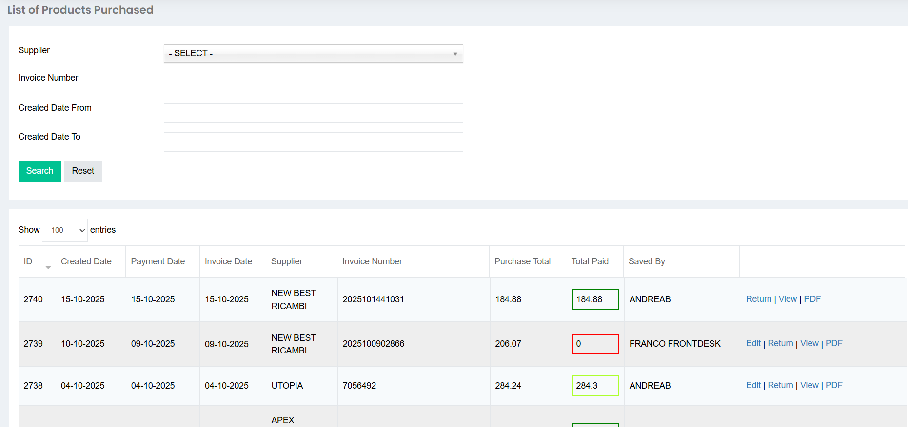

#### 🟦 1. Basic Information
| Field | Description |
| :--- | :--- |
| **Page ID:** | `P-013` |
| **Page Name:** | Product Purchase Search |
| **Page Type:** | Search / List |
| **Page URL:** | `/en/frontdesk/product-purchases` |
| **Purpose:** | To search, view, and manage all records of products purchased from suppliers. This page serves as the main entry point for tracking inventory costs and payments. |
| **Accessible by:**| Manager, Admin |
| **Note:** | The on-screen title is "List of Products Purchased". |

---
#### 🟨 3. Filters / Search
| Label | Field Name | Type | Logic | Notes |
| :--- | :--- | :--- | :--- | :--- |
| **Supplier** | `supplier_tid` | Searchable Dropdown | Exact Match | Filters purchases by the supplier. |
| **Invoice Number** | `invoice_number` | Text Input | Contains | Searches for a specific supplier invoice number. |
| **Created Date From**| `created_date_start`| Date Picker | Greater than or equal to | Sets the start of a date range for when the purchase was recorded in the system. |
| **Created Date To** | `created_date_end` | Date Picker | Less than or equal to | Sets the end of a date range for when the purchase was recorded. |

---
#### 🟩 4. Buttons & Actions
| Button Name | Type | Function / Behavior |
| :--- | :--- | :--- |
| **Search** | Submit Button | Executes the search query and populates the results table. |
| **Reset** | Reset Button | Clears all filter fields. |

---
#### 🟦 5. Expected Outputs
* A paginated data table listing all product purchase records that match the filter criteria.
* The "Total Paid" column is color-coded to indicate payment status: green for fully paid, red for unpaid or partially paid.

**Table Columns**
| Column Header | Data Source | Notes |
| :--- | :--- | :--- |
| **ID** | `id` | The unique ID of the purchase record. |
| **Created Date** | `createdDate` | When the record was entered into the system. |
| **Payment Date** | `paymentDate` | The date payment was made to the supplier. |
| **Invoice Date** | `invoiceDate` | The date on the supplier's invoice. |
| **Supplier** | `supplier.name` | Name of the supplier. |
| **Invoice Number** | `invoiceNumber` | The supplier's invoice number. |
| **Purchase Total** | `purchaseTotal` | The total value of the invoice. |
| **Total Paid** | `totalPaid` | The amount paid to the supplier. |
| **Saved By** | `user.name` | The employee who recorded the purchase. |
| **(Actions)** | - | A set of links for actions like `Return`, `Edit`, `View`, `PDF`. |

---
#### 🟫 7. Workflow
1.  User navigates to **Expenses > Product Purchase > Search**.
2.  User enters criteria into the filter fields to find specific purchase records.
3.  User clicks the **"Search"** button.
4.  The table below updates with the filtered results.
5.  User can review the payment status via the color-coded "Total Paid" column.
6.  User can click action links like `Edit` or `View` to see the details of a specific purchase.

---
#### 🟧 8. Additional Notes / Integration
* This page is the primary interface for managing accounts payable to suppliers.
* The `Total Paid` status is a key visual indicator. A value of `0` or less than the `Purchase Total` is shown in red, while a fully paid amount is green.

---

---
[Back to Main Navigation Menu](#2-main-navigation-menu)

### Page: Add Product Purchase

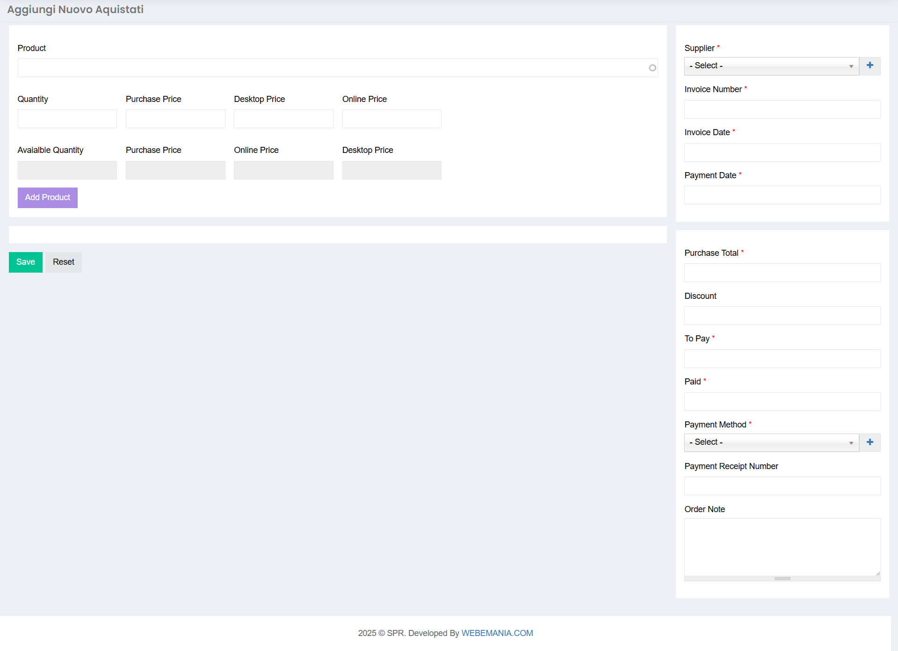

#### 🟦 1. Basic Information
| Field | Description |
| :--- | :--- |
| **Page ID:** | `P-014` |
| **Page Name:** | Add Product Purchase |
| **Page Type:** | Create Form |
| **Page URL:** | `/en/frontdesk/product-purchase/add` |
| **Purpose:** | To create a detailed record of a new product purchase from a supplier, including individual line items and payment information, which updates inventory levels and financial records. |
| **Accessible by:**| Manager, Admin |
| **Note:** | The on-screen title is "Add New Purchases" (Aggiungi Nuovo Aquistati). |

---
#### 🟧 2. Input Fields
This page is divided into two main sections: a product entry/cart section on the left, and an invoice/payment details section on the right.

**Part A: Product Entry Section**
| # | Label | Field Name | Type | Required | Default | Behavior / Notes |
| :--- | :--- | :--- | :--- | :--- | :--- | :--- |
| 1 | **Product** | `product` | Autocomplete Text | Yes (for each item) | Empty | User searches for an existing product by name or SKU. Selecting a product populates the read-only fields below. |
| 2 | **Quantity** | `quantity` | Number | Yes (for each item) | Empty | The number of units of the product being purchased. |
| 3 | **Purchase Price** | `purchase_price` | Number | Yes (for each item) | Empty | The cost per unit for this specific purchase. |
| 4 | **Desktop Price** | `desktop_price` | Number | No | Empty | A new or updated in-store selling price for this product. |
| 5 | **Online Price** | `online_price` | Number | No | Empty | A new or updated e-commerce selling price for this product. |
| 6 | **Available Quantity**| `available_quantity`| Number (Read-only)| - | - | Shows the current stock level of the selected product before this purchase. |
| 7 | **(Current) Purchase Price**| `current_purchase_price`| Number (Read-only)| - | - | Shows the existing purchase price of the product for reference. |
| 8 | **(Current) Online Price**| `current_online_price`| Number (Read-only)| - | - | Shows the existing online selling price. |
| 9 | **(Current) Desktop Price**| `current_desktop_price`| Number (Read-only)| - | - | Shows the existing desktop selling price. |

**Part B: Invoice & Payment Section**
| # | Label | Field Name | Type | Required | Default | Behavior / Notes |
| :--- | :--- | :--- | :--- | :--- | :--- | :--- |
| 10 | **Supplier** | `supplier_tid` | Dropdown | Yes | `- Select -` | Links to `Suppliers`. A `+` button opens a modal to add a new supplier. |
| 11 | **Invoice Number** | `invoice_number` | Text Input | Yes | Empty | The supplier's official invoice number for this purchase. |
| 12 | **Invoice Date** | `invoice_date` | Date Picker | Yes | Empty | The date printed on the supplier's invoice. |
| 13 | **Payment Date** | `payment_date` | Date Picker | Yes | Empty | The date the payment was or will be made. |
| 14 | **Purchase Total** | `purchase_total` | Number | Yes | Empty | The gross total amount of the invoice. |
| 15 | **Discount** | `discount` | Number | No | Empty | Any discount received from the supplier on this invoice. |
| 16 | **To Pay** | `total_amount` | Number (Read-only)| Yes | - | Calculated field: `Purchase Total` - `Discount`. |
| 17 | **Paid** | `total_paid` | Number | Yes | Empty | The actual amount paid to the supplier for this invoice. |
| 18 | **Payment Method** | `payment_method_tid`| Dropdown | Yes | `- Select -` | Links to `Payment Methods`. `+` button opens a modal to add a new method. |
| 19 | **Payment Receipt Number**|`payment_method_receipt_number`| Text Input | No | Empty | Reference number for the payment transaction. |
| 20 | **Order Note** | `note` | Text Area | No | Empty | General notes about the purchase order. |

---
#### 🟩 4. Buttons & Actions
| Button Name | Type | Function / Behavior |
| :--- | :--- | :--- |
| **Add Product** | Button | Adds the product configured in the "Product Entry Section" to a list/cart below. This list constitutes the items on the purchase invoice. |
| **Save** | Submit | Validates and saves the entire purchase record, including all added products and payment details. |
| **Reset** | Reset | Clears all fields in both sections and the product cart. |

---
#### 🟦 5. Expected Outputs
1.  A new **Product Purchase** record is created, containing all invoice details and the list of purchased items.
2.  A new **Transaction** record is created in the financial ledger, logging the `Paid` amount as an expense.
3.  The `stock` level for each product in the purchase is **incremented** by the specified `Quantity`.
4.  If new selling prices (`Desktop Price`, `Online Price`) were entered for an item, the master `Product` record is updated with these new prices.
5.  A success confirmation is displayed to the user.

---
#### 🟪 6. Validation Rules
| Field | Rule / Description | Error Message (Implied) |
| :--- | :--- | :--- |
| `Supplier` | Must be selected. | This field is required. |
| `Invoice Number`| Must not be empty. | This field is required. |
| `Invoice Date` | Must be a valid date. | This field is required. |
| `Payment Date` | Must be a valid date. | This field is required. |
| `Purchase Total`| Must not be empty and must be a valid number. | This field is required. |
| `To Pay` | Must not be empty and must be a valid number. | This field is required. |
| `Paid` | Must not be empty and must be a valid number. | This field is required. |
| `Payment Method`| Must be selected. | This field is required. |

---
#### 🟫 7. Workflow
1.  User navigates to **Expenses > Product Purchase > Add Product Purchase**.
2.  In the right column, the user fills in the supplier and invoice details (`Supplier`, `Invoice Number`, `Invoice Date`, `Payment Date`).
3.  In the left column, the user searches for a **Product**, enters the `Quantity` and the new `Purchase Price`. Optionally, they can update the selling prices.
4.  User clicks the **"Add Product"** button. The item is added to a list that forms the purchase order.
5.  User repeats steps 3-4 for all products on the invoice.
6.  User fills out the final payment details in the right column (`Purchase Total`, `Discount`, `Paid`, etc.).
7.  User clicks **"Save"** to record the entire purchase.

---

---
[Back to Main Navigation Menu](#2-main-navigation-menu)

### Page: General Expenses (Search)

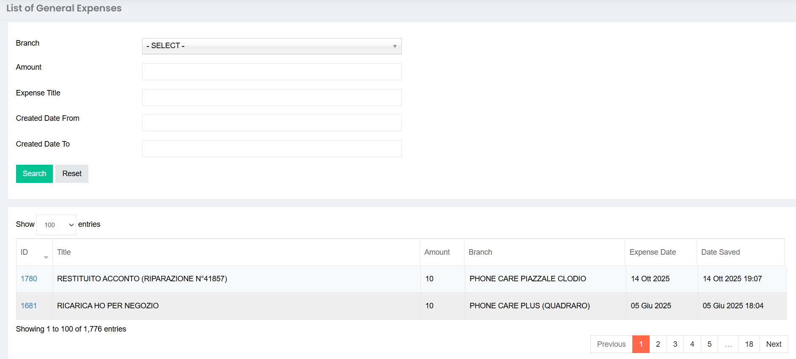

#### 🟦 1. Basic Information
| Field | Description |
| :--- | :--- |
| **Page ID:** | `P-015` |
| **Page Name:** | General Expenses Search |
| **Page Type:** | Search / List |
| **Page URL:** | `/en/frontdesk/general-expenses` |
| **Purpose:** | To search, view, and manage all recorded general business expenses that are not tied to inventory purchases (e.g., rent, salaries, utilities). |
| **Accessible by:**| Manager, Admin |
| **Note:** | The on-screen title is "General Expense List". |

---
#### 🟨 3. Filters / Search
| Label | Field Name | Type | Logic | Notes |
| :--- | :--- | :--- | :--- | :--- |
| **Branch** | `branch` | Dropdown | Exact Match | Filters expenses by the branch that recorded them. |
| **Amount** | `amount` | Text Input | Contains / Exact Match | Filters by the monetary value of the expense. |
| **Expense Title** | `title` | Text Input | Contains | Searches for keywords within the expense description. |
| **Created Date From**| `created_date_from`| Date Picker | Greater than or equal to | Sets the start of a date range for when the expense was recorded. |
| **Created Date To** | `created_date_to` | Date Picker | Less than or equal to | Sets the end of a date range. |

---
#### 🟩 4. Buttons & Actions
| Button Name | Type | Function / Behavior |
| :--- | :--- | :--- |
| **Search** | Submit Button | Executes the search query and populates the results table. |
| **Reset** | Reset Button | Clears all filter fields. |
| **Add General Expense**| Link / Button | Navigates to the "Add New General Expense" page. |

---
#### 🟦 5. Expected Outputs
* A paginated data table showing all general expenses that match the filter criteria.
* A summary of the total number of entries found.

**Table Columns**
| Column Header | Data Source | Notes |
| :--- | :--- | :--- |
| **ID** | `id` | The unique ID of the expense record. Links to the edit page for that expense. |
| **Title** | `title` | The description of the expense. |
| **Amount** | `amount` | The monetary value of the expense. |
| **Branch** | `branch.name` | The branch associated with the expense. |
| **Expense Date** | `expenseDate` | The date the expense was incurred. |
| **Date Saved** | `dateSaved` | The timestamp when the record was entered into the system. |

---
#### 🟫 7. Workflow
1.  User navigates to **Expenses > Expenses (General) > Search**.
2.  The page loads with a list of recent general expenses.
3.  User can apply filters at the top to find specific records.
4.  User clicks the **"Search"** button to apply the filters.
5.  The table updates to show the filtered results.
6.  User can click on an **ID** in the results to navigate to the edit page for that expense.
7.  User can click **"Add General Expense"** to navigate to the creation form.

---

---
[Back to Main Navigation Menu](#2-main-navigation-menu)

### Page: Add New General Expense

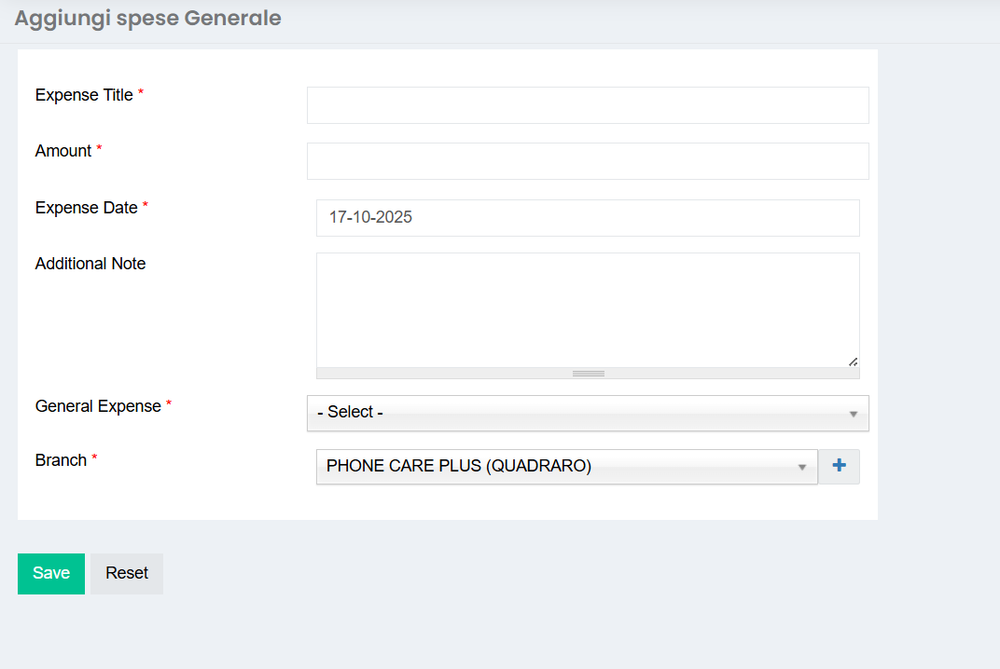

#### 🟦 1. Basic Information
| Field | Description |
| :--- | :--- |
| **Page ID:** | `P-016` |
| **Page Name:** | Add New General Expense |
| **Page Type:** | Create Form |
| **Page URL:** | `/en/frontdesk/general-expenses/add` |
| **Purpose:** | To create a record for a general, non-inventory expense, such as rent, salaries, or utilities. |
| **Accessible by:**| Manager, Admin |

---
#### 🟧 2. Input Fields
| # | Label | Field Name | Type | Required | Default | Behavior / Notes |
| :--- | :--- | :--- | :--- | :--- | :--- | :--- |
| 1 | **Expense Title** | `title` | Text Input | Yes | Empty | A brief, descriptive title for the expense. |
| 2 | **Amount** | `amount` | Number | Yes | Empty | The monetary value of the expense. |
| 3 | **Expense Date** | `expense_date` | Date Picker | Yes | Current Date | The date the expense was incurred. Auto-populates with the current date. |
| 4 | **Additional Note** | `notes` | Text Area | No | Empty | A field for any extra details about the expense. |
| 5 | **General Expense** | `general_expense_tid` | Dropdown | Yes | `- SELECT -` | This is the Expense Type/Category. Links to a configurable list of expense types. |
| 6 | **Branch** | `branch_tid` | Dropdown | Yes | `- SELECT -` | The branch that incurred the expense. `+` button opens a modal to add a new branch. |

---
#### 🟩 4. Buttons & Actions
| Button Name | Type | Function / Behavior |
| :--- | :--- | :--- |
| **Save** | Submit | Validates the form. On success, creates a new `General Expense` record and a corresponding financial `Transaction`. |
| **Reset** | Reset | Clears all input fields on the form. |
| **Khata** | Submit & Redirect | Saves the expense and then redirects the user to the "Khata Online" financial report page. |

---
#### 🟦 5. Expected Outputs
1.  A new **General Expense** record is created in the database.
2.  A new **Transaction** record is created in the financial ledger, logging the `Amount` as an `expense`.
3.  A success message is displayed. If "Khata" was clicked, the user is redirected to the report page.

---
#### 🟪 6. Validation Rules
| Field | Rule / Description | Error Message (Implied) |
| :--- | :--- | :--- |
| `title` | Must not be empty. | This field is required. |
| `amount` | Must not be empty and must be a valid number. | This field is required. |
| `expense_date`| Must be a valid date. | This field is required. |
| `general_expense_tid` | Must be selected. | This field is required. |
| `branch_tid` | Must be selected. | This field is required. |

---
#### 🟫 7. Workflow
1.  User navigates to **Expenses > Expenses (General) > Add New General Expense**.
2.  User fills in all the required details for the expense.
3.  User clicks **"Save"** to record the expense, or **"Khata"** to save and immediately view its impact on the financial report.
4.  The system creates the necessary records and provides feedback.

---

---
[Back to Main Navigation Menu](#2-main-navigation-menu)

### Page: List of Order Parts

#### 🟦 1. Basic Information
| Field | Description |
| :--- | :--- |
| **Page ID:** | `P-011` |
| **Page Name:** | List of Order Parts |
| **Page Type:** | Search / List |
| **Page URL:** | `/en/frontdesk/order-parts/all` |
| **Purpose:** | To provide a filterable list of all spare part orders, allowing staff to track their status from order placement to delivery. |
| **Accessible by:**| Technician, FrontDesk Executive, Manager, Admin |
| **Note:** | The on-screen title is "Order List". |

---
#### 🟨 3. Filters / Search
| Label | Field Name | Type | Logic | Notes |
| :--- | :--- | :--- | :--- | :--- |
| **Order Parts Type**| `order_parts_type_tid` | Dropdown | Exact Match | Filters by the type of item ordered (e.g., "SPARE PARTS"). |
| **Ordered?** | `is_ordered` | Dropdown (Yes/No/Select) | Boolean Match | Filters orders based on whether they have been placed with the supplier. |
| **Already Delivered?**| `is_delivered` | Dropdown (Yes/No/Select) | Boolean Match | Filters orders based on whether the parts have been received from the supplier. |

---
#### 🟩 4. Buttons & Actions
| Button Name | Type | Function / Behavior |
| :--- | :--- | :--- |
| **Search** | Submit Button | Executes the search query using the selected filter criteria and updates the results table. |
| **Reset** | Reset Button | Clears all the filter fields to their default state. |

---
#### 🟦 5. Expected Outputs
* A paginated data table displaying the spare part orders that match the filter criteria.
* A summary of the total number of entries found is displayed.

**Table Columns**
| Column Header | Data Source | Notes |
| :--- | :--- | :--- |
| **ID** | `id` | The unique order ID. Links to the edit page for the order. |
| **Part Details** | `model`, `brand`, `color` | A summary of the part being ordered. |
| **Customer** | `customer.name` | Links to the customer's details page. |
| **Replacement** | `productName` | The name or description of the part. |
| **Quantity** | `quantity` | The number of units ordered. |
| **Acceptance Number**| `acceptanceNumber` | Links the order to a specific repair job. |
| **Branch** | `branch.name` | The branch that placed the order. |
| **Urgent?** | `isUrgent` | Displays "Yes" or "No". |
| **Ordered?** | `isOrdered` | Displays "Yes" or "No". |
| **Delivered?** | `isDelivered` | Displays "Yes" or "No". |
| **Payment** | `totalAmount`, `paidAmount` | Shows "Total Bill" and "Paid" amounts in Italian ("Pagato"). |
| **Last Edit** | `lastEdited` | The timestamp of the last modification to the order. |
| **(Actions)** | - | Links for `Edit`, `Print`, and `Email`. |

---
#### 🟫 7. Workflow
1.  User navigates to **Sale/ Order System > Order Spare parts > List of Order Parts**.
2.  The page loads with a list of recent part orders.
3.  User can select filter criteria such as `Ordered?` or `Delivered?` to track order status.
4.  User clicks the **"Search"** button.
5.  The table updates to show the filtered results.
6.  User can click on an `ID` or `Edit` link to view or modify a specific order.

---

---
[Back to Main Navigation Menu](#2-main-navigation-menu)

## 6. Module: Options

This module contains high-level administrative, reporting, and configuration pages, primarily for managers and administrators.

### Page: Transactions

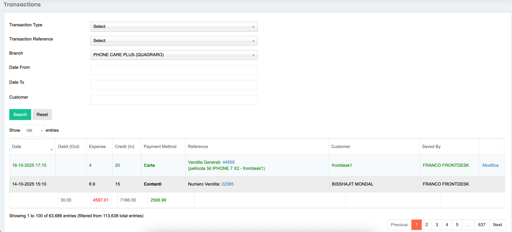

#### 🟦 1. Basic Information
| Field | Description |
| :--- | :--- |
| **Page ID:** | `P-017` |
| **Page Name:** | Transactions |
| **Page Type:** | Report / List |
| **Page URL:** | `/en/frontdesk/accounts/transactions` |
| **Purpose:** | To provide a detailed, line-by-line log of all financial events (income and expenses) recorded in the system for auditing and review. This acts as the central financial ledger. |
| **Accessible by:**| Manager, Admin |

---
#### 🟨 3. Filters / Search
| Label | Field Name | Type | Logic | Notes |
| :--- | :--- | :--- | :--- | :--- |
| **Transaction #** | `transaction_id` (Assumed) | Text Input | Contains / Exact Match | Filters by the unique ID of the transaction record itself. |
| **Reference #** | `reference_id` (Assumed) | Text Input | Contains / Exact Match | Filters by the ID of the source record (e.g., Sale ID, Expense ID). |
| **Date From**| `date_from` (Assumed)| Date Picker | Greater than or equal to | Sets the start of a date range for the search. |
| **Date To** | `date_to` (Assumed) | Date Picker | Less than or equal to | Sets the end of a date range for the search. |

---
#### 🟩 4. Buttons & Actions
| Button Name | Type | Function / Behavior |
| :--- | :--- | :--- |
| **Search** | Submit Button | Executes the search query using the specified filter criteria and updates the results table. |
| **Reset** | Reset Button | Clears all the filter fields to their default state. |

---
#### 🟦 5. Expected Outputs
* A paginated data table displaying all financial transactions that match the filter criteria.
* The table serves as a comprehensive log of all money moving in and out of the business.

**Table Columns**
| Column Header | Data Source | Notes |
| :--- | :--- | :--- |
| **Transaction #** | `id` | The unique ID of the transaction. |
| **Reference #** | `linkedEntityId` | The ID of the source event (e.g., Sale, Expense). This is a hyperlink to the source record's detail page. |
| **Date** | `date` | The date and time of the transaction. |
| **Payment Method** | `paymentMethod` | How the transaction was paid (e.g., Cash, Card). |
| **Note** | `description` | A description of the transaction. |
| **Total IN** | `income` | The amount of money received (income). |
| **Total OUT** | `expense` | The amount of money spent (expense). |

---
#### 🟫 7. Workflow
1.  User navigates to **Options > Managerial Tasks > Transactions**.
2.  The page loads displaying a complete history of all financial transactions.
3.  User can enter criteria into the filter fields (e.g., a date range and a specific Reference #).
4.  User clicks the **"Search"** button.
5.  The table updates to show only the filtered results.
6.  User can click on a **Reference #** to navigate to the original source of the transaction (e.g., the specific sale or expense record).

---
#### 🟧 8. Additional Notes / Integration
* This page is a read-only report. Transactions are not created here but are generated automatically when other actions are performed in the system, such as completing a sale, adding an expense, or recording a product purchase.
* It is the foundational data source for other financial reports like the "Khata Online" page.

---

---
[Back to Main Navigation Menu](#2-main-navigation-menu)

### Page: Khata Online

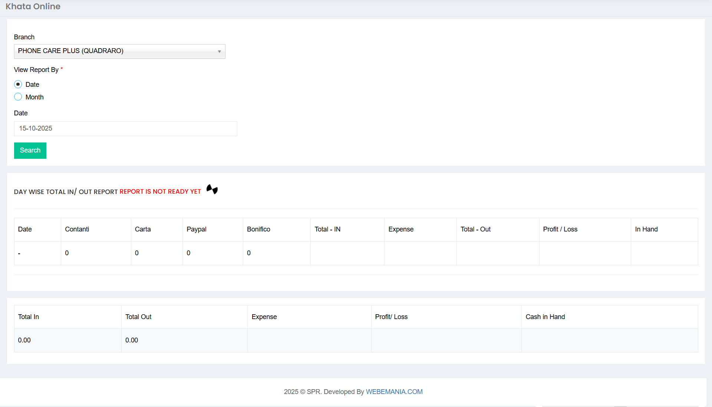

#### 🟦 1. Basic Information
| Field | Description |
| :--- | :--- |
| **Page ID:** | `P-018` |
| **Page Name:** | Khata Online |
| **Page Type:** | Report / Dashboard |
| **Page URL:** | `/en/frontdesk/accounts/khata-online` |
| **Purpose:** | To provide a daily or monthly financial summary (Profit/Loss statement) for a selected branch, breaking down income by payment method and totaling all expenses. |
| **Accessible by:**| Manager, Admin |

---
#### 🟨 3. Filters / Search
| Label | Field Name | Type | Logic | Notes |
| :--- | :--- | :--- | :--- | :--- |
| **Branch** | `branch_tid` (Assumed) | Dropdown | Exact Match | Selects the branch for which to generate the report. |
| **View Report By** | `report_by` (Assumed) | Radio Buttons | Toggles Filter | Switches between "Date" and "Month" view. This determines which transactions are aggregated. |
| **Date** | `date` (Assumed) | Date Picker | Exact Match / Month Match | Becomes active when "View Report By" is selected. User picks a specific date or month. |

---
#### 🟩 4. Buttons & Actions
| Button Name | Type | Function / Behavior |
| :--- | :--- | :--- |
| **Search** | Submit Button | Generates and displays the financial report for the selected branch and time period in the table below. |

---
#### 🟦 5. Expected Outputs
* A summary table showing the breakdown of income and expenses for the selected period.
* A footer row with grand totals for the entire period shown.
* The main table shows "DAY WISE TOTAL IN/OUT REPORT IS NOT READY YET", indicating this part of the report is either incomplete or populates after a search.

**Report Table Columns**
| Column Header | Data Source | Notes |
| :--- | :--- | :--- |
| **Date** | `transaction.date` | The specific date or month of the report row. |
| **Contanti** | `transaction.income` | Sum of income where payment method is "Cash" (Contanti). |
| **Carta** | `transaction.income` | Sum of income where payment method is "Card" (Carta). |
| **Paypal** | `transaction.income` | Sum of income where payment method is "Paypal". |
| **Bonifico** | `transaction.income` | Sum of income where payment method is "Bank Transfer" (Bonifico). |
| **Total - IN** | `transaction.income` | Sum of all income for the period. |
| **Expense** | `transaction.expense`| Sum of all expenses for the period. |
| **Total - Out** | `transaction.expense`| Same as "Expense". |
| **Profit / Loss** | Calculated | `Total IN` - `Total Out`. |
| **In Hand** | Calculated | The net cash position (`Cash Income` - `Cash Expenses`). |

---
#### 🟫 7. Workflow
1.  User navigates to **Options > Managerial Tasks > Khata Online**.
2.  The user selects a **Branch** from the dropdown.
3.  The user chooses to view the report by **"Date"** or **"Month"**.
4.  The user selects the specific date or month.
5.  User clicks the **"Search"** button.
6.  The system aggregates all `Transaction` records matching the criteria and displays the summarized financial data in the report table.

---
#### 🟧 8. Additional Notes / Integration
* This page is a high-level summary report derived entirely from the data in the master `Transaction` table.
* The accuracy of this report depends on the correct and consistent recording of all sales, purchases, and expenses throughout the application.

---

---
[Back to Main Navigation Menu](#2-main-navigation-menu)

### Page: DDT Viewer

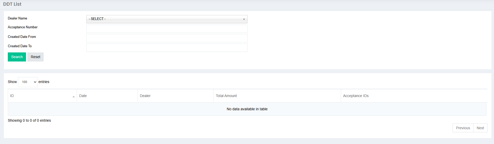

#### 🟦 1. Basic Information
| Field | Description |
| :--- | :--- |
| **Page ID:** | `P-019` |
| **Page Name:** | DDT Viewer / List |
| **Page Type:** | Search / List |
| **Page URL:** | `/en/frontdesk/acceptance/ddt-list` (Assumed) |
| **Purpose:** | To search for and view a list of generated DDTs (Documento di Trasporto), which are transport documents likely used for transferring devices between branches or to dealers. |
| **Accessible by:**| Manager, Admin |
| **Note:** | The on-screen title is "DDT List". |

---
#### 🟨 3. Filters / Search
| Label | Field Name | Type | Logic | Notes |
| :--- | :--- | :--- | :--- | :--- |
| **Dealer Name** | `dealer_name` (Assumed) | Dropdown | Exact Match | Filters the DDT list by the dealer it was generated for. |
| **Acceptance Number**| `acceptance_number` (Assumed) | Text Input | Contains | Finds a DDT by searching for a specific repair job number included in it. |
| **Created Date From**| `created_date_from` (Assumed) | Date Picker | Greater than or equal to | Sets the start of the date range for when the DDT was created. |
| **Created Date To** | `created_date_to` (Assumed) | Date Picker | Less than or equal to | Sets the end of the date range. |

---
#### 🟩 4. Buttons & Actions
| Button Name | Type | Function / Behavior |
| :--- | :--- | :--- |
| **Search** | Submit Button | Executes the search query using the provided filters and updates the results table below. |
| **Reset** | Reset Button | Clears all the filter fields to their default state. |

---
#### 🟦 5. Expected Outputs
* A paginated data table displaying the DDTs that match the filter criteria. The table in the screenshot is empty, indicating "No data available in table".

**Table Columns**
| Column Header | Data Source | Notes |
| :--- | :--- | :--- |
| **ID** | `id` | The unique ID of the DDT document. |
| **Date** | `date` | The creation date of the DDT. |
| **Dealer** | `dealer.name` | The name of the dealer associated with the DDT. |
| **Total Amount** | `totalAmount` | The total value of the items included in the DDT. |
| **Acceptance IDs** | `acceptanceIds` | A list of the repair job numbers included in this transport document. |

---
#### 🟫 7. Workflow
1.  User navigates to **Options > Managerial Tasks > DDT Viewer**.
2.  The page loads with an empty list and search filters.
3.  User enters search criteria, such as a `Dealer Name` and a `Date Range`.
4.  User clicks the **"Search"** button.
5.  The table populates with a list of all DDTs matching the search criteria.

---

---
[Back to Main Navigation Menu](#2-main-navigation-menu)

### Page: DDT Generator

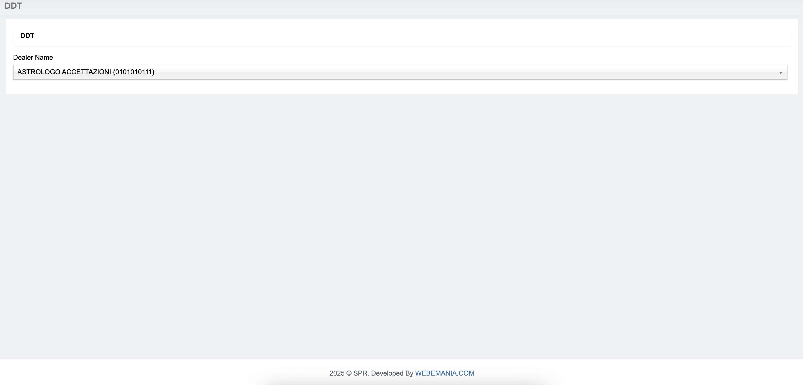

#### 🟦 1. Basic Information
| Field | Description |
| :--- | :--- |
| **Page ID:** | `P-020` |
| **Page Name:** | DDT Generator |
| **Page Type:** | Utility / Report Generator |
| **Page URL:** | `/en/frontdesk/acceptance/ddt` |
| **Purpose:** | To generate a transport document (DDT - Documento di Trasporto) for moving one or more repair jobs (Acceptances) to a specific dealer. |
| **Accessible by:**| Manager, Admin |
| **Note:** | The on-screen title is simply "DDT". |

---
#### 🟧 2. Input Fields
| # | Label | Field Name | Type | Required | Default | Behavior / Notes |
| :--- | :--- | :--- | :--- | :--- | :--- | :--- |
| 1 | **Dealer Name** | `dealer_uid` | Searchable Dropdown | Yes | Empty | This is the primary control. Selecting a dealer from this list dynamically loads a list of associated, pending repair jobs into the area below the dropdown. |
| 2 | **(Acceptance List)** | `acceptance_ids[]` (Inferred) | Checkboxes | Yes | - | **Hidden until a dealer is selected.** A list of repair jobs for the selected dealer appears, each with a checkbox. The user must select at least one job to generate the DDT. |

---
#### 🟩 4. Buttons & Actions
| Button Name | Type | Function / Behavior |
| :--- | :--- | :--- |
| **Generate DDT** | Submit (Inferred) | Appears after a dealer is selected. It takes all checked Acceptance IDs and generates the transport document. It may also update the status of these jobs to "In Transit". |

---
#### 🟦 5. Expected Outputs
1.  A new **DDT** record is created in the database, linking the dealer to the selected `Job` IDs.
2.  A downloadable/printable **PDF** of the DDT is generated.
3.  The `currentStatus` of the included `Job` records might be updated (e.g., to "Transferred").
4.  The user is redirected to the DDT Viewer page or shown a success message with a link to the document.

---
#### 🟫 7. Workflow
1.  User navigates to **Options > Managerial Tasks > DDT Generator**.
2.  User selects a **Dealer Name** from the dropdown.
3.  The system makes an AJAX call to fetch and display all pending repair jobs for that dealer, each with a checkbox.
4.  User selects the specific jobs they want to include in the transport document.
5.  User clicks the "Generate DDT" button (inferred).
6.  The system generates the document and updates the status of the included jobs.

---
#### 🟧 8. Additional Notes / Integration
* This page is a key part of the workflow for managing repairs sent to external dealers or between branches.
* The functionality is highly dynamic, relying on AJAX to load the list of repair jobs after a dealer is selected. The empty `
` in the HTML confirms this behavior.

---

---
[Back to Main Navigation Menu](#2-main-navigation-menu)

### Page: Attendances

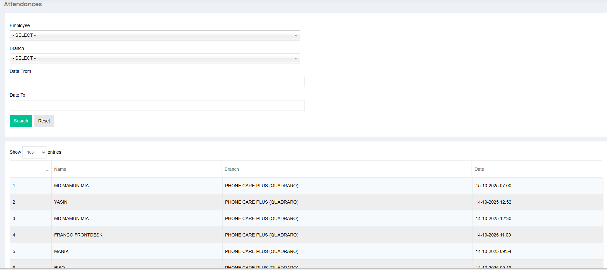

#### 🟦 1. Basic Information
| Field | Description |
| :--- | :--- |
| **Page ID:** | `P-021` |
| **Page Name:** | Attendances |
| **Page Type:** | Report / Search / List |
| **Page URL:** | `/en/frontdesk/employees/attendance` (Assumed) |
| **Purpose:** | To track and review employee attendance records, allowing managers to filter by employee, branch, and date range. |
| **Accessible by:**| Manager, Admin |

---
#### 🟨 3. Filters / Search
| Label | Field Name | Type | Logic | Notes |
| :--- | :--- | :--- | :--- | :--- |
| **Employee** | `employee` (Assumed) | Dropdown | Exact Match | Filters the list to a specific employee. |
| **Branch** | `branch` (Assumed) | Dropdown | Exact Match | Filters attendance records by branch. |
| **Date From** | `date_from` (Assumed) | Date Picker | Greater than or equal to | Sets the start date for the search range. |
| **Date To** | `date_to` (Assumed) | Date Picker | Less than or equal to | Sets the end date for the search range. |

---
#### 🟩 4. Buttons & Actions
| Button Name | Type | Function / Behavior |
| :--- | :--- | :--- |
| **Search** | Submit Button | Executes the search based on the filter criteria and displays the results in the table. |
| **Reset** | Reset Button | Clears all filter fields to their default state. |

---
#### 🟦 5. Expected Outputs
* A paginated data table listing all attendance records that match the filter criteria.
* A summary of the total number of entries found.

**Table Columns**
| Column Header | Data Source | Notes |
| :--- | :--- | :--- |
| **(Serial #)** | - | A sequential number for the current view. |
| **Name** | `employee.name` | The name of the employee who clocked in/out. |
| **Branch** | `branch.name` | The branch where the attendance was recorded. |
| **Date** | `attendance.timestamp` | The exact date and time of the attendance record. |

---
#### 🟫 7. Workflow
1.  User navigates to **Options > Managerial Tasks > Attendances**.
2.  The page loads displaying recent attendance records.
3.  The user selects an `Employee`, `Branch`, and/or a `Date Range` to generate a specific report.
4.  The user clicks the **"Search"** button.
5.  The table updates to show the attendance records matching the filters.

---
#### 🟧 8. Additional Notes / Integration
* This page is for viewing attendance data. The actual mechanism for "clocking in" or "clocking out" is not present on this screen and is likely located elsewhere in the application, possibly on the main dashboard for logged-in users.

---

---
[Back to Main Navigation Menu](#2-main-navigation-menu)

### Page: Employee Performance

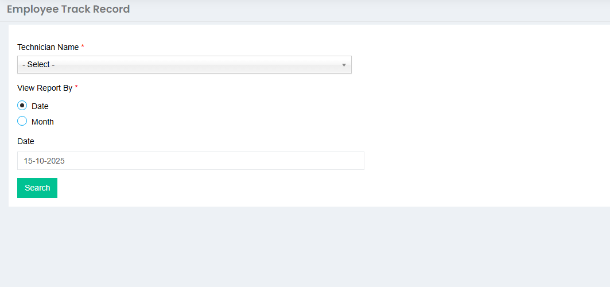

#### 🟦 1. Basic Information
| Field | Description |
| :--- | :--- |
| **Page ID:** | `P-022` |
| **Page Name:** | Employee Performance |
| **Page Type:** | Report / Search Form |
| **Page URL:** | `/en/frontdesk/employee-track-record` (Assumed) |
| **Purpose:** | To generate and view a performance report for a specific technician over a selected date or month. |
| **Accessible by:**| Manager, Admin |
| **Note:** | The on-screen title is "Employee Track Record". |

---
#### 🟨 3. Filters / Search
| Label | Field Name | Type | Required | Default | Behavior / Notes |
| :--- | :--- | :--- | :--- | :--- | :--- |
| **Technician Name** | `technician_name` (Assumed) | Dropdown | Yes | `- Select -` | Filters the report to a single employee. |
| **View Report By** | `report_by` (Assumed) | Radio Buttons | Yes | `Date` | Toggles the filter logic between a single day or an entire month. |
| **Date** | `date` (Assumed) | Date Picker | Yes | Current Date | The specific date or month for the report, depending on the "View Report By" selection. |

---
#### 🟩 4. Buttons & Actions
| Button Name | Type | Function / Behavior |
| :--- | :--- | :--- |
| **Search** | Submit Button | Generates and displays the performance report for the selected technician and time period. |

---
#### 🟦 5. Expected Outputs
* **Note:** The screenshot only shows the filter form; the output is not visible. The expected output is a report or data table displayed below the form after a search is performed.
* **Inferred Output:** The report would likely contain performance metrics for the selected technician, such as:
    * Total number of jobs assigned.
    * Number of jobs completed.
    * Total revenue or profit generated from their repairs.
    * Average time to complete a repair.

---
#### 🟫 7. Workflow
1.  User navigates to **Options > Managerial Tasks > Employee Performance**.
2.  The user must select a **Technician Name** from the dropdown.
3.  The user selects whether to view the report by **Date** or **Month**.
4.  The user selects a specific date or month.
5.  User clicks the **"Search"** button.
6.  The system queries the `jobs` data, calculates the performance metrics, and displays the report on the page.

---
#### 🟧 8. Additional Notes / Integration
* This is a purely analytical page that reads data from the `jobs` (Acceptances) table.
* The backend needs to perform aggregation queries (COUNT, SUM, AVG) on the `jobs` table, filtered by `technician_id` and the specified date range.

---

---
[Back to Main Navigation Menu](#2-main-navigation-menu)

### Page: Final Accounts

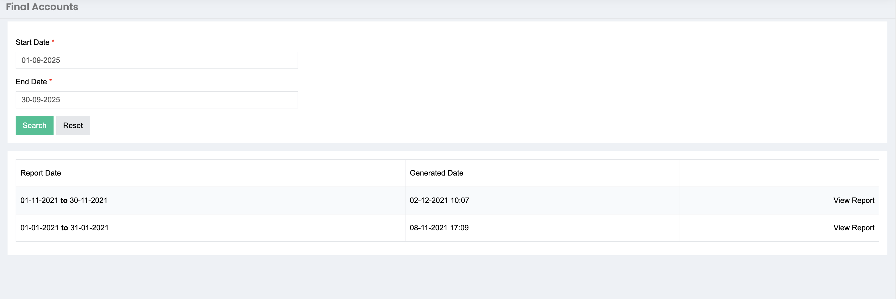

#### 🟦 1. Basic Information
| Field | Description |
| :--- | :--- |
| **Page ID:** | `P-023` |
| **Page Name:** | Final Accounts |
| **Page Type:** | Report Generator / List |
| **Page URL:** | `/en/frontdesk/accounts/final-accounts` |
| **Purpose:** | To generate and view historical, end-of-period financial summary reports based on a specified date range. |
| **Accessible by:**| Manager, Admin |

---
#### 🟨 3. Filters / Search
| Label | Field Name | Type | Required | Default | Notes |
| :--- | :--- | :--- | :--- | :--- | :--- |
| **Start Date** | `rpt_start_date` | Date Picker | Yes | e.g., `01-09-2025` | Sets the beginning of the reporting period. |
| **End Date** | `rpt_end_date` | Date Picker | Yes | e.g., `30-09-2025` | Sets the end of the reporting period. |

---
#### 🟩 4. Buttons & Actions
| Button Name | Type | Function / Behavior |
| :--- | :--- | :--- |
| **Search** | Submit Button | Submits the selected date range to generate a new final account report. The newly generated report is then added to the list below. |
| **Reset** | Reset Button | Clears the `Start Date` and `End Date` fields. |
| **View Report** | Link | Clicks on this link for a historical report. It populates the `Start Date` and `End Date` fields with the report's range and resubmits the form to display that specific report. |

---
#### 🟦 5. Expected Outputs
* A list of previously generated "Final Account" reports.
* When a report is generated or viewed, a detailed financial summary (not visible in the screenshot) is displayed, likely containing aggregated totals for income, expenses, and profit for the period.

**Table Columns**
| Column Header | Data Source | Notes |
| :--- | :--- | :--- |
| **Report Date** | `report_date_range` | The start and end dates of the generated report. |
| **Generated Date**| `generated_date` | The timestamp when the report was originally created. |
| **(Actions)** | - | Contains the "View Report" link. |

---
#### 🟫 7. Workflow
1.  User navigates to **Options > Managerial Tasks > Final Accounts**.
2.  The page displays a list of previously generated reports.
3.  **To view an old report:** The user clicks the "View Report" link for the desired period. The system populates the date fields and re-runs the report generation for that timeframe.
4.  **To generate a new report:** The user selects a new `Start Date` and `End Date`.
5.  The user clicks the **"Search"** button.
6.  The system calculates the final accounts for that period and displays the detailed report. The new report entry is also saved and added to the historical list.

---
#### 🟧 8. Additional Notes / Integration
* This page seems to be a more formal version of the "Khata Online" report, intended for creating permanent, end-of-period financial statements.
* The `viewFa()` JavaScript function indicates that clicking "View Report" populates the filter fields and programmatically submits the form to regenerate the view for that period.

---

---
[Back to Main Navigation Menu](#2-main-navigation-menu)

### Page: Current Balance

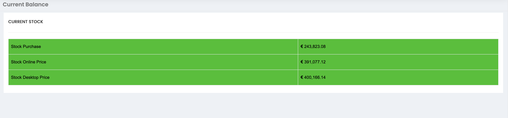

#### 🟦 1. Basic Information
| Field | Description |
| :--- | :--- |
| **Page ID:** | `P-024` |
| **Page Name:** | Current Balance |
| **Page Type:** | Report / Dashboard |
| **Page URL:** | `/en/frontdesk/accounts/current-balance` (Assumed) |
| **Purpose:** | To provide a high-level, real-time overview of the total value of the company's current inventory, broken down by cost and potential revenue. |
| **Accessible by:**| Manager, Admin |

---
#### 🟦 5. Expected Outputs
* A simple summary table displaying the total aggregated values of all products currently in stock. This page has no input fields.

**Report Table**
| Label | Data Source / Calculation | Notes |
| :--- | :--- | :--- |
| **Current Stock** | - | This is the main heading for the report section. |
| **Stock Purchase** | SUM(`product.stock` * `product.purchasePrice`) | Represents the total cost value of all inventory currently held. |
| **Stock Online Price** | SUM(`product.stock` * `product.onlinePrice`) | Represents the total potential revenue if all stock were sold at the online price. |
| **Stock Desktop Price**| SUM(`product.stock` * `product.desktopPrice`)| Represents the total potential revenue if all stock were sold at the in-store (desktop) price. |

---
#### 🟫 7. Workflow
1.  User navigates to **Options > Managerial Tasks > Current Balance**.
2.  The page loads and immediately displays the calculated stock values. There are no actions to be taken on this page.

---
#### 🟧 8. Additional Notes / Integration
* This page is a critical financial dashboard that provides an instant snapshot of the company's inventory asset value.
* The calculations are performed in real-time by querying the entire `Products` table, multiplying the stock quantity of each product by its respective price, and summing the results.

---

---
[Back to Main Navigation Menu](#2-main-navigation-menu)

## 7. Module: System

This module contains core administrative functions for managing foundational data like users, customers, and suppliers. Access should be restricted to administrators.

### Page: User Management

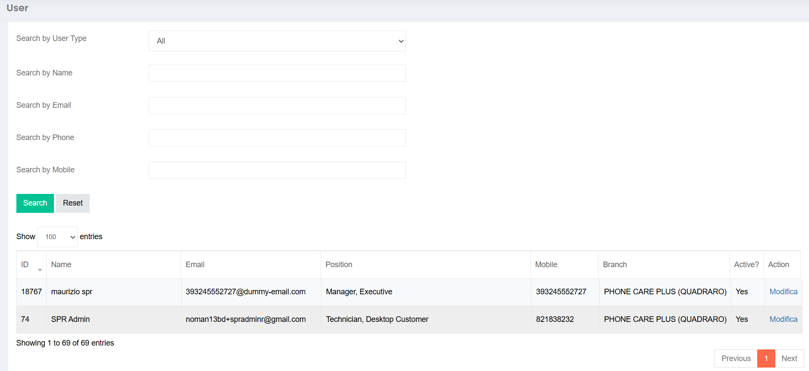

#### 🟦 1. Basic Information
| Field | Description |
| :--- | :--- |
| **Page ID:** | `P-025` |
| **Page Name:** | User Management |
| **Page Type:** | Search / List |
| **Page URL:** | `/en/frontdesk/employees` (Assumed) |
| **Purpose:** | To view, search, and manage all internal user accounts (employees, dealers, technicians) in the system. |
| **Accessible by:**| Admin |
| **Note:** | The on-screen title is "Users List". |

---
#### 🟨 3. Filters / Search
| Label | Field Name | Type | Logic | Notes |
| :--- | :--- | :--- | :--- | :--- |
| **Search by User Type** | `rid` | Dropdown | Exact Match | Filters the user list by their assigned role (e.g., "Manager", "Technician"). |
| **Search by Name** | `name` | Text Input | Contains | Searches for a user by their full name. |
| **Search by Email** | `email` | Text Input | Contains | Searches for a user by their email address. |
| **Search by Phone** | `phone` | Text Input | Contains | Searches for a user by their phone number. |
| **Search by Mobile** | `mobile` | Text Input | Contains | Searches for a user by their mobile number. |

---
#### 🟩 4. Buttons & Actions
| Button Name | Type | Function / Behavior |
| :--- | :--- | :--- |
| **Search** | Submit Button | Applies the selected filters and updates the user list. |
| **Reset** | Reset Button | Clears all filter fields. |
| **Add User** | Link / Button | Navigates to the "Add User" form. |
| **Modifica** (Edit) | Link | Navigates to the "Edit User" page for the selected user. |

---
#### 🟦 5. Expected Outputs
* A paginated data table listing all user accounts that match the filter criteria.

**Table Columns**
| Column Header | Data Source | Notes |
| :--- | :--- | :--- |
| **ID** | `id` | The unique user ID. |
| **Name** | `name` | The user's full name. |
| **Email** | `email` | The user's email address. |
| **Position** | `roles` | The roles assigned to the user (e.g., "Manager", "FrontDesk Executive"). |
| **Mobile** | `mobile` | The user's mobile number. |
| **Branch** | `branch.name` | The primary branch the user is associated with. |
| **Active?** | `isActive` | Indicates if the user account is currently active or disabled. |
| **Action** | - | Contains the "Modifica" (Edit) link for the user. |

---
#### 🟫 7. Workflow
1.  User navigates to **System > User Management**.
2.  The page loads displaying a list of all users.
3.  The user can apply filters to find specific users or user groups.
4.  User clicks **"Search"**.
5.  The table updates to show the filtered list of users.
6.  User can click **"Modifica"** (Edit) on any user row to go to the user's edit page.
7.  User can click **"Add User"** to go to the new user creation form.

---

---
[Back to Main Navigation Menu](#2-main-navigation-menu)

### Page: Add User

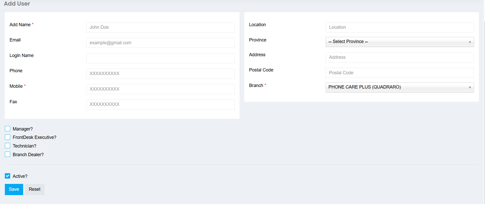

#### 🟦 1. Basic Information
| Field | Description |
| :--- | :--- |
| **Page ID:** | `P-026` |
| **Page Name:** | Add User |
| **Page Type:** | Create Form |
| **Page URL:** | `/en/frontdesk/employees/add` (Assumed) |
| **Purpose:** | To create a new user account for an employee, assign them roles, and associate them with a branch. |
| **Accessible by:**| Admin |

---
#### 🟧 2. Input Fields
| # | Label | Field Name | Type | Required | Default | Behavior / Notes |
| :--- | :--- | :--- | :--- | :--- | :--- | :--- |
| 1 | **Add Name** | `name` | Text Input | Yes | Empty | The full name of the user. Placeholder: "John Doe". |
| 2 | **Email** | `email` | Email Input | Yes | Empty | The user's primary email address. Placeholder: "example@gmail.com". |
| 3 | **Login Name** | `login_name` | Text Input | No | Empty | An alternative username for login, if different from the email. |
| 4 | **Phone** | `phone` | Text Input | No | Empty | The user's landline phone number. |
| 5 | **Mobile** | `mobile` | Text Input | Yes | Empty | The user's mobile phone number. |
| 6 | **Fax** | `fax` | Text Input | No | Empty | The user's fax number. |
| 7 | **Location** | `location` | Text Input | No | Empty | The city or area where the user resides. |
| 8 | **Province** | `province` | Dropdown | No | `- Select Province -` | A list of provinces. |
| 9 | **Address** | `address` | Text Input | No | Empty | The user's full street address. |
| 10| **Postal Code** | `postal-code` | Text Input | No | Empty | The user's postal code. |
| 11| **Branch** | `branch_tid` | Dropdown | Yes | - | The branch the user is assigned to. |
| 12| **Roles** | `roles[]` | Checkboxes | No | None checked | A list of available roles to assign to the user (e.g., Manager, Technician). |
| 13| **Active?** | `active_inactive` | Checkbox | No | Checked | A flag to determine if the user account is enabled upon creation. |

---
#### 🟩 4. Buttons & Actions
| Button Name | Type | Function / Behavior |
| :--- | :--- | :--- |
| **Save** | Submit | Validates and submits the form to create a new user record in the database. |
| **Reset** | Reset | Clears all input fields on the form. |

---
#### 🟦 5. Expected Outputs
1.  A new **User** record is created in the database.
2.  The user is redirected to the **User Management** list page, where the new user should now be visible.
3.  A success confirmation message is displayed.

---
#### 🟪 6. Validation Rules
| Field | Rule / Description | Error Message (Implied) |
| :--- | :--- | :--- |
| `name` | Must not be empty. | This field is required. |
| `email` | Must not be empty and must be a valid email format. | This field is required. |
| `mobile` | Must not be empty. | This field is required. |
| `branch_tid` | Must be selected. | This field is required. |

---
#### 🟫 7. Workflow
1.  User navigates to **System > Add User** (or clicks "Add User" from the User Management page).
2.  The user fills out the form with the new employee's personal details, contact information, and address.
3.  The user assigns the user to a **Branch** and selects one or more **Roles**.
4.  The user clicks the **"Save"** button.
5.  The system creates the user account and redirects back to the user list.

---

---
[Back to Main Navigation Menu](#2-main-navigation-menu)

### Page: Customers

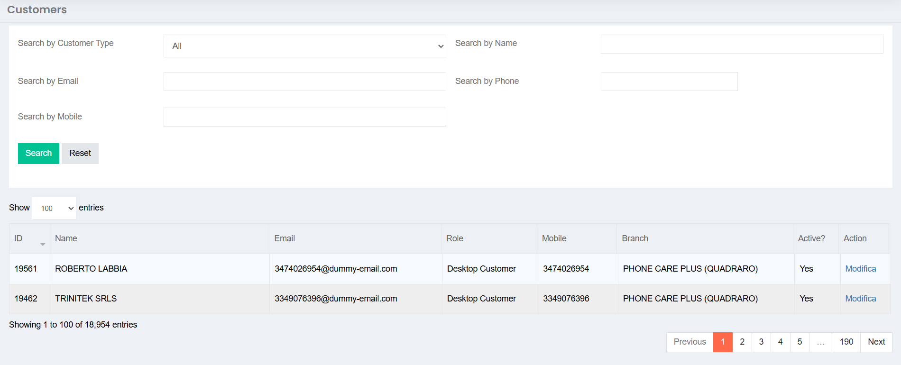

#### 🟦 1. Basic Information
| Field | Description |
| :--- | :--- |
| **Page ID:** | `P-027` |
| **Page Name:** | Customers |
| **Page Type:** | Search / List |
| **Page URL:** | `/en/frontdesk/customers` (Assumed) |
| **Purpose:** | To view, search, and manage all external customer accounts in the system. This page is similar to User Management but is specifically for clients. |
| **Accessible by:**| FrontDesk Executive, Manager, Admin |
| **Note:** | The on-screen title is "Customers List". |

---
#### 🟨 3. Filters / Search
| Label | Field Name | Type | Logic | Notes |
| :--- | :--- | :--- | :--- | :--- |
| **Search by Customer Type**| `rid` | Dropdown | Exact Match | Filters the customer list by their type (e.g., "All", "Desktop Customer"). |
| **Search by Name** | `name` | Text Input | Contains | Searches for a customer by their full name. |
| **Search by Email** | `email` | Text Input | Contains | Searches for a customer by their email address. |
| **Search by Phone** | `phone` | Text Input | Contains | Searches for a customer by their phone number. |
| **Search by Mobile** | `mobile` | Text Input | Contains | Searches for a customer by their mobile number. |

---
#### 🟩 4. Buttons & Actions
| Button Name | Type | Function / Behavior |
| :--- | :--- | :--- |
| **Search** | Submit Button | Applies the selected filters and updates the customer list. |
| **Reset** | Reset Button | Clears all filter fields. |
| **Add Customer** | Link / Button | Navigates to the "Add Customer" form. |
| **Modifica** (Edit) | Link | Navigates to the "Edit Customer" page for the selected customer. |

---
#### 🟦 5. Expected Outputs
* A paginated data table listing all customer accounts that match the filter criteria.

**Table Columns**
| Column Header | Data Source | Notes |
| :--- | :--- | :--- |
| **ID** | `id` | The unique customer ID. |
| **Name** | `name` | The customer's full name. |
| **Email** | `email` | The customer's email address. |
| **Role** | `customerTypes` | The type of customer (e.g., "Desktop Customer"). |
| **Mobile** | `mobile` | The customer's mobile number. |
| **Branch** | `branch.name` | The primary branch the customer is associated with. |
| **Active?** | `isActive` | Indicates if the customer account is currently active or disabled. |
| **Action** | - | Contains the "Modifica" (Edit) link for the customer. |

---
#### 🟫 7. Workflow
1.  User navigates to **System > Customers**.
2.  The page loads displaying a list of all customers.
3.  The user can apply filters to find specific customers.
4.  User clicks **"Search"**.
5.  The table updates to show the filtered list.
6.  User can click **"Modifica"** (Edit) on any row to go to that customer's edit page.
7.  User can click **"Add Customer"** to go to the new customer creation form.

---

---
[Back to Main Navigation Menu](#2-main-navigation-menu)

### Page: Add Customer

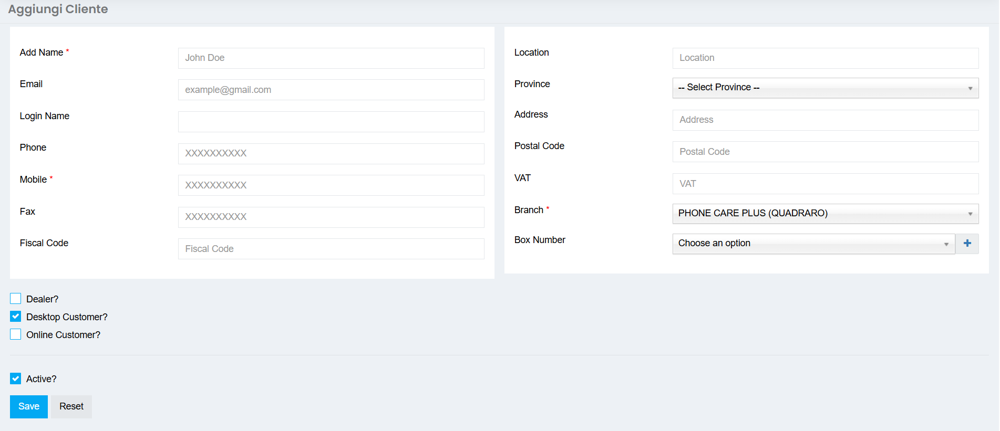

#### 🟦 1. Basic Information
| Field | Description |
| :--- | :--- |
| **Page ID:** | `P-028` |
| **Page Name:** | Add Customer |
| **Page Type:** | Create Form |
| **Page URL:** | `/en/frontdesk/customer/add/nojs` |
| **Purpose:** | To create a new external customer account. This form distinguishes customers from internal users by including fields like Fiscal Code and VAT. |
| **Accessible by:**| FrontDesk Executive, Manager, Admin |
| **Note:** | The on-screen title is "Aggiungi Cliente" (Add Customer). |

---
#### 🟧 2. Input Fields
| # | Label | Field Name | Type | Required | Default | Behavior / Notes |
| :--- | :--- | :--- | :--- | :--- | :--- | :--- |
| 1 | **Add Name** | `name` | Text Input | Yes | Empty | The customer's full name or company name. Placeholder: "John Doe". |
| 2 | **Email** | `email` | Email Input | No | Empty | Placeholder: "example@gmail.com". |
| 3 | **Login Name** | `login_name` | Text Input | No | Empty | A specific username for the customer if they need to log in. |
| 4 | **Phone** | `phone` | Text Input | No | Empty | The customer's landline number. |
| 5 | **Mobile** | `mobile` | Text Input | Yes | Empty | The customer's mobile number. |
| 6 | **Fax** | `fax` | Text Input | No | Empty | |
| 7 | **Fiscal Code** | `fiscal-code` | Text Input | No | Empty | The customer's Italian fiscal code. |
| 8 | **Location** | `location` | Text Input | No | Empty | City or area. |
| 9 | **Province** | `province` | Dropdown | No | `- Select Province -` | A list of provinces. |
| 10| **Address** | `address` | Text Input | No | Empty | The customer's full street address. |
| 11| **Postal Code** | `postal-code` | Text Input | No | Empty | |
| 12| **VAT** | `vat` | Text Input | No | Empty | The customer's VAT number, for business clients. |
| 13| **Branch** | `branch_tid` | Dropdown | Yes | - | The branch the customer is primarily associated with. |
| 14| **Box Number** | `box_number_tid` | Dropdown | No | `Choose an option` | A `+` button opens a modal to add a new box number. |
| 15| **Dealer?** | `isDealer` | Checkbox | No | Unchecked | A flag to mark the customer as a dealer. |
| 16| **Desktop Customer?**| `isDesktopCustomer`| Checkbox | No | Checked | A flag to mark the customer as an in-store (desktop) customer. |
| 17| **Online Customer?**| `isCustomer` | Checkbox | No | Unchecked | A flag to mark the customer as an online customer. |
| 18| **Active?** | `active_inactive` | Checkbox | No | Checked | A flag to determine if the customer account is enabled upon creation. |

---
#### 🟩 4. Buttons & Actions
| Button Name | Type | Function / Behavior |
| :--- | :--- | :--- |
| **Save** | Submit | Validates and submits the form to create a new customer record. |
| **Reset** | Reset | Clears all input fields on the form. |

---
#### 🟦 5. Expected Outputs
1.  A new **Customer** record is created in the database.
2.  The user is redirected to the **Customers** list page, where the new customer should now be visible.
3.  A success confirmation message is displayed.

---
#### 🟪 6. Validation Rules
| Field | Rule / Description | Error Message (Implied) |
| :--- | :--- | :--- |
| `name` | Must not be empty. | This field is required. |
| `mobile` | Must not be empty. | This field is required. |
| `branch_tid` | Must be selected. | This field is required. |

---
#### 🟫 7. Workflow
1.  User navigates to **System > Add Customer**.
2.  The user fills out the form with the customer's details and address information.
3.  The user selects the appropriate customer type(s) using the checkboxes.
4.  The user clicks the **"Save"** button.
5.  The system creates the customer account and redirects back to the customer list.

---

---
[Back to Main Navigation Menu](#2-main-navigation-menu)

### Page: Suppliers

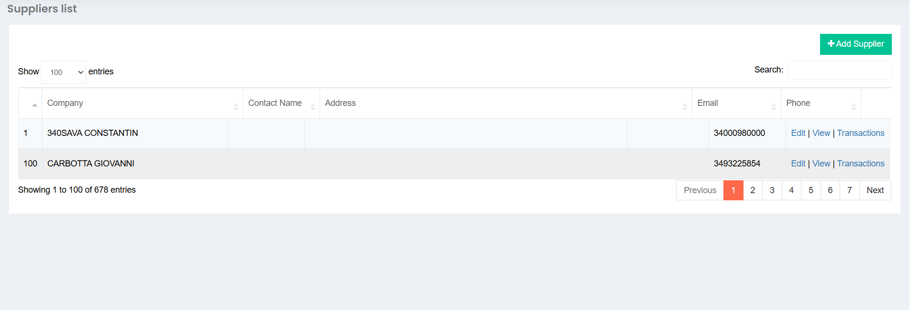

#### 🟦 1. Basic Information
| Field | Description |
| :--- | :--- |
| **Page ID:** | `P-029` |
| **Page Name:** | Suppliers |
| **Page Type:** | Search / List |
| **Page URL:** | `/en/frontdesk/voc/supplier` (Assumed) |
| **Purpose:** | To view, search, and manage all records of suppliers from whom products are purchased. |
| **Accessible by:**| Manager, Admin |
| **Note:** | The on-screen title is "Suppliers list". |

---
#### 🟨 3. Filters / Search
| Label | Field Name | Type | Logic | Notes |
| :--- | :--- | :--- | :--- | :--- |
| **Show Entries** | `vocab-data-table_length` | Dropdown | - | Changes the number of records displayed per page (e.g., 10 or 100). |
| **Search** | (Global Search) | Text Input | Contains | A global search field that filters all columns in the table in real-time as the user types. |

---
#### 🟩 4. Buttons & Actions
| Button Name | Type | Function / Behavior |
| :--- | :--- | :--- |
| **Add Supplier** | Link / Button | Navigates to the "Add Supplier" form. |
| **Edit** | Link | Navigates to the "Edit Supplier" page for the selected record. |
| **View** | Link | Navigates to a detailed, read-only view of the supplier's information. |
| **Transactions** | Link | Navigates to a list of all product purchases associated with that supplier. |

---
#### 🟦 5. Expected Outputs
* A paginated data table listing all suppliers.

**Table Columns**
| Column Header | Data Source | Notes |
| :--- | :--- | :--- |
| **(Serial #)** | - | A sequential number for the current view. |
| **Company** | `companyName` | The name of the supplier. |
| **Contact Name** | `contactName` | |
| **Address** | `address` | |
| **Email** | `email` | |
| **Phone** | `phone` | |
| **(Actions)** | - | Contains the links for `Edit`, `View`, and `Transactions`. |

---
#### 🟫 7. Workflow
1.  User navigates to **System > Suppliers**.
2.  The page loads displaying a list of all suppliers.
3.  User can type in the **Search** box to instantly filter the list.
4.  User can click on an action link (`Edit`, `View`, `Transactions`) for a specific supplier.
5.  User can click **"Add Supplier"** to navigate to the creation form.

---

---
[Back to Main Navigation Menu](#2-main-navigation-menu)

### Page: Add Supplier

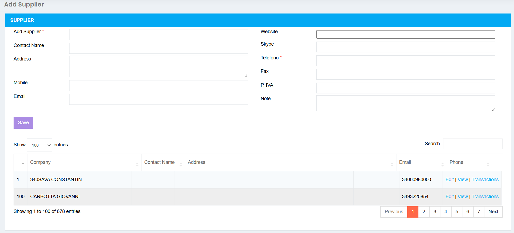

#### 🟦 1. Basic Information
| Field | Description |
| :--- | :--- |
| **Page ID:** | `P-030` |
| **Page Name:** | Add Supplier |
| **Page Type:** | Create Form |
| **Page URL:** | `/en/frontdesk/voc/supplier/add/nojs` |
| **Purpose:** | To create a new record for a supplier, including their contact and business information. |
| **Accessible by:**| Manager, Admin |

---
#### 🟧 2. Input Fields
| # | Label | Field Name | Type | Required | Default | Behavior / Notes |
| :--- | :--- | :--- | :--- | :--- | :--- | :--- |
| 1 | **Add Supplier** | `name` | Text Input | Yes | Empty | The primary name of the supplier company or individual. |
| 2 | **Contact Name** | `field_contact_name[und][0][value]` | Text Input | No | Empty | The name of a specific contact person at the company. |
| 3 | **Address** | `field_branch_address[und][0][value]` | Text Area | No | Empty | The physical address of the supplier. |
| 4 | **Mobile** | `field_mobile[und][0][value]` | Text Input | No | Empty | The supplier's mobile number. |
| 5 | **Email** | `field_email[und][0][value]` | Email Input | No | Empty | The supplier's contact email. |
| 6 | **Website** | `field_website[und][0][url]` | URL Input | No | Empty | The supplier's official website. |
| 7 | **Skype** | `field_skype[und][0][value]` | Text Input | No | Empty | The supplier's Skype ID. |
| 8 | **Telefono (Phone)**| `field_phone[und][0][value]` | Text Input | Yes | Empty | The supplier's main phone number. |
| 9 | **Fax** | `field_fax[und][0][value]` | Text Input | No | Empty | The supplier's fax number. |
| 10| **P. IVA (VAT Number)** | `field_partita_iva[und][0][value]` | Text Input | No | Empty | The supplier's Value Added Tax identification number. |
| 11| **Note** | `field_branch_license_information[und][0][value]`| Text Area | No | Empty | A field for any additional notes about the supplier. |

---
#### 🟩 4. Buttons & Actions
| Button Name | Type | Function / Behavior |
| :--- | :--- | :--- |
| **Save** | Submit | Validates the form and creates a new supplier record in the database. |

---
#### 🟦 5. Expected Outputs
1.  A new **Supplier** record is created in the database.
2.  The user is likely redirected back to the **Suppliers** list page, where the new entry is now visible.
3.  A success message is displayed.

---
#### 🟪 6. Validation Rules
| Field | Rule / Description | Error Message (Implied) |
| :--- | :--- | :--- |
| `name` | Must not be empty. | This field is required. |
| `field_phone[und][0][value]` | Must not be empty. | This field is required. |

---
#### 🟫 7. Workflow
1.  User navigates to **System > Add Supplier**.
2.  The user fills in the supplier's details, ensuring the required fields ("Add Supplier" and "Telefono") are completed.
3.  The user clicks the **"Save"** button.
4.  The system creates the new supplier record and refreshes the list below or redirects to the main supplier list page.

---
#### 🟧 8. Additional Notes / Integration
* This page has an unusual layout where the form for adding a new entry is displayed directly above the list of existing entries. Upon saving, the list below the form is updated to include the new supplier.

---

---
[Back to Main Navigation Menu](#2-main-navigation-menu)

### Page: Box Numbers

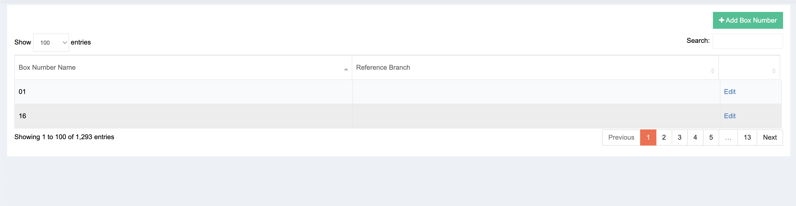

#### 🟦 1. Basic Information
| Field | Description |
| :--- | :--- |
| **Page ID:** | `P-031` |
| **Page Name:** | Box Numbers |
| **Page Type:** | Master Data / List |
| **Page URL:** | `/en/frontdesk/voc/box_number` (Inferred) |
| **Purpose:** | To create, view, and manage a list of physical storage locations (e.g., shelf numbers, bin numbers) used to organize devices or products within the shop. |
| **Accessible by:**| Manager, Admin |

---
#### 🟨 3. Filters / Search
| Label | Field Name | Type | Logic | Notes |
| :--- | :--- | :--- | :--- | :--- |
| **Show Entries** | `vocab-data-table_length` | Dropdown | - | Changes the number of records displayed per page (e.g., 10 or 100). |
| **Search** | (Global Search) | Text Input | Contains | A global search field that filters all columns in the table in real-time as the user types. |

---
#### 🟩 4. Buttons & Actions
| Button Name | Type | Function / Behavior |
| :--- | :--- | :--- |
| **Add Box Number** | Link / Button | Navigates to a form (likely a modal) to create a new box number. |
| **Edit** | Link | Navigates to a form to modify the details of the selected box number. |

---
#### 🟦 5. Expected Outputs
* A paginated data table listing all defined box numbers.

**Table Columns**
| Column Header | Data Source | Notes |
| :--- | :--- | :--- |
| **Box Number Name**| `name` | The name or identifier of the box (e.g., "01", "16"). |
| **Reference Branch**| `branch.name` | The branch this box number belongs to. This column is present but empty in the screenshot. |
| **(Actions)** | - | Contains the `Edit` link. |

---
#### 🟫 7. Workflow
1.  User navigates to **System > Box Numbers**.
2.  The page loads displaying a list of all box numbers.
3.  The user can use the **Search** field to quickly find a specific box number.
4.  User can click **"Add Box Number"** to create a new one.
5.  User can click **"Edit"** on an existing row to modify it.

---
#### 🟧 8. Additional Notes / Integration
* This is a simple master data management page. The "Box Numbers" created here are used in dropdowns on other pages, such as the "Add Customer" form, to associate items or people with a physical location.

---

---
[Back to Main Navigation Menu](#2-main-navigation-menu)

## 8. Module: Tracking Device

This module is used to manage the lifecycle of individual, serialized devices (likely used phones or high-value items) that are bought and resold. It tracks each device from purchase to sale.

### Page: Tracking Devices List

#### 🟦 1. Basic Information
| Field | Description |
| :--- | :--- |
| **Page ID:** | `P-032` |
| **Page Name:** | Tracking Devices List |
| **Page Type:** | Search / List |
| **Page URL:** | `/en/frontdesk/tracking-devices` (Inferred) |
| **Purpose:** | To provide a comprehensive view and advanced search capabilities for all individually tracked devices in the system. |
| **Accessible by:**| Manager, Admin |
| **Note:** | The on-screen title is "Devices". |

---
#### 🟨 3. Filters / Search
The page features an extensive set of filters, with an "Expand/Close" toggle for advanced options.

| Label | Field Name | Type | Logic | Notes |
| :--- | :--- | :--- | :--- | :--- |
| **Device ID** | `device_id` (Assumed) | Text Input | Exact Match | Searches for a specific internal device ID. |
| **IMEI/ Serial No** | `imei` | Text Input | Contains | Searches by the device's unique identifier. |
| **Model** | `model` | Dropdown | Exact Match | Filters by the specific device model. |
| **Customer Name** | `customer_name` | Dropdown | Exact Match | Filters by the customer who purchased the device. |
| **Supplier** | `supplier` | Dropdown | Exact Match | Filters by the supplier from whom the device was purchased. |
| **Condition** | `condition` | Dropdown | Exact Match | Filters by the device's condition (e.g., "all", "Used", "New"). |
| **Sold Items Only** | `sold_only` (Assumed) | Checkbox | Boolean | If checked, shows only devices that have been sold. |
| **Un Sold Items Only**| `unsold_only` (Assumed) | Checkbox | Boolean | If checked, shows only devices currently in stock. |
| **Brand** | `brand` | Dropdown | Exact Match | (In advanced search) Filters by brand. |
| **Device Type** | `device_type` | Dropdown | Exact Match | (In advanced search) Filters by type (e.g., Smartphone). |
| **Device Category**| `device_category`| Dropdown | Exact Match | (In advanced search) Filters by a broader category. |
| **Purchase Date From/To**|`purchase_date`| Date Pickers | Date Range | (In advanced search) Filters by when the device was acquired. |
| **Sale Date From/To**| `sale_date` | Date Pickers | Date Range | (In advanced search) Filters by when the device was sold. |
| **Sale Price** | `sale_price` | Text Input | Exact Match | (In advanced search) Filters by the price the device was sold for. |
| **Deleted?** | `deleted` | Dropdown (Yes/No) | Boolean Match | (In advanced search) Allows viewing deleted device records. |
| **Branch** | `branch` | Dropdown | Exact Match | (In advanced search) Filters by the branch that owns the device. |

---
#### 🟩 4. Buttons & Actions
| Button Name | Type | Function / Behavior |
| :--- | :--- | :--- |
| **Search** | Submit Button | Applies all selected filters and refreshes the device list. |
| **Reset** | Reset Button | Clears all filter fields. |
| **MODIFICA** (Edit)| Link | Navigates to the edit page for the specific device record. |
| **BARCODE** | Link | Generates a barcode for the specific device. |
| **FATTURA ACQUISTO**| Link | (Purchase Invoice) Generates the purchase invoice for the device. |
| **SALE INVOICE** | Link | Generates the sales invoice for the device. |

---
#### 🟦 5. Expected Outputs
* A paginated data table listing all tracked devices that match the search criteria.

**Table Columns**
| Column Header | Data Source | Notes |
| :--- | :--- | :--- |
| **ID** | `id` | Unique record ID. |
| **Purchase Date** | `purchaseDate` | The date the device was acquired. |
| **IMEI** | `imei` | The device's unique identifier. |
| **Suppliers** | `supplier.name` | The source of the device. |
| **Purchase Price**| `purchasePrice` | The cost of acquiring the device. |
| **Brand** | `brand.name` | |
| **Model** | `model.name` | |
| **Color** | `color.name` | |
| **Condition** | `condition` | E.g., "USED", "NEW". |
| **Capacity** | `ram`, `rom` | Shows RAM and ROM details. |
| **Links** | - | Contains the action links (`MODIFICA`, `BARCODE`, etc.). |

---
#### 🟫 7. Workflow
1.  User navigates to **Tracking Device > Tracking Devices List**.
2.  The page loads with a list of recently added devices.
3.  The user can use the extensive filters to find specific devices (e.g., all "Unsold" iPhones in a specific branch).
4.  The user clicks **"Search"**.
5.  The table updates with the filtered results.
6.  User can click on an action link in the "Links" column to edit the device, generate a barcode, or view related invoices.

---

---
[Back to Main Navigation Menu](#2-main-navigation-menu)

### Page: Add Tracking Device

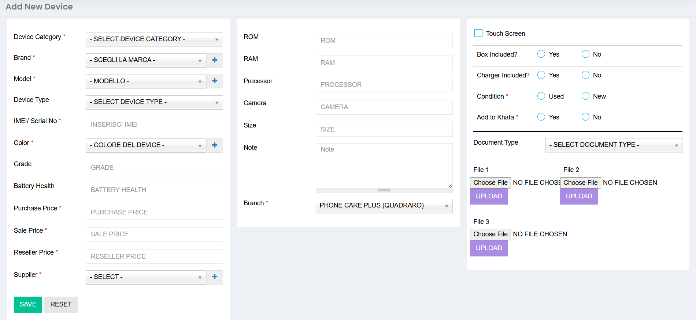

#### 🟦 1. Basic Information
| Field | Description |
| :--- | :--- |
| **Page ID:** | `P-033` |
| **Page Name:** | Add New Device |
| **Page Type:** | Create Form |
| **Page URL:** | `/en/frontdesk/tracking-device/add` (Assumed) |
| **Purpose:** | To register a new, individually tracked device (like a used phone for resale) into the system, detailing its specifications, condition, cost, and pricing. |
| **Accessible by:**| Manager, Admin |

---
#### 🟧 2. Input Fields
The form is laid out in three columns.

| # | Label | Field Name | Type | Required | Default | Behavior / Notes |
| :--- | :--- | :--- | :--- | :--- | :--- | :--- |
| 1 | **Device Category** | `device_category` | Dropdown | Yes | `- SELECT DEVICE CATEGORY -` | |
| 2 | **Brand** | `brand` | Searchable Dropdown | Yes | `- CHOOSE BRAND -` | `+` button opens a modal to add a new brand. |
| 3 | **Model** | `model` | Searchable Dropdown | Yes | `- MODEL -` | Dependent on Brand. `+` button to add a new model. |
| 4 | **Device Type** | `device_type` | Dropdown | Yes | `- SELECT DEVICE TYPE -` | |
| 5 | **IMEI/ Serial No** | `imei` | Text Input | Yes | Empty | Placeholder: "Enter IMEI". |
| 6 | **Color** | `color` | Dropdown | Yes | `- DEVICE COLOR -` | `+` button opens a modal to add a new color. |
| 7 | **Grade** | `grade` | Text Input | No | Empty | For quality grading (e.g., A, B, C). Placeholder: "GRADE". |
| 8 | **Battery Health** | `battery_health` | Text Input | No | Empty | e.g., "95%". Placeholder: "BATTERY HEALTH". |
| 9 | **Purchase Price** | `purchase_price` | Number | Yes | Empty | The cost to acquire the device. |
| 10 | **Sale Price** | `sale_price` | Number | Yes | Empty | The price for a standard customer sale. |
| 11 | **Reseller Price** | `reseller_price` | Number | Yes | Empty | A special price for resellers/dealers. |
| 12 | **Supplier** | `supplier` | Dropdown | Yes | `- SELECT -` | The person or company the device was purchased from. `+` button to add a new supplier. |
| 13 | **ROM** | `rom` | Text Input | No | Empty | Internal storage capacity. |
| 14 | **RAM** | `ram` | Text Input | No | Empty | Memory capacity. |
| 15 | **Processor** | `processor` | Text Input | No | Empty | |
| 16 | **Camera** | `camera` | Text Input | No | Empty | |
| 17 | **Size** | `size` | Text Input | No | Empty | Screen or physical size. |
| 18 | **Note** | `note` | Text Area | No | Empty | General notes about the device. |
| 19 | **Branch** | `branch` | Dropdown | Yes | Pre-selected | The branch acquiring the device. |
| 20 | **Touch Screen** | `touch_screen` | Checkbox | No | Unchecked | |
| 21 | **Box Included?** | `box_included` | Radio (Yes/No) | No | No | |
| 22 | **Charger Included?**| `charger_included`| Radio (Yes/No) | Yes | - | |
| 23 | **Condition** | `condition` | Radio (Used/New) | Yes | - | |
| 24 | **Add to Khata?** | `add_to_khata` | Radio (Yes/No) | Yes | - | If "Yes", the purchase price will be added as an expense in the financial ledger. |
| 25 | **Document Type** | `document_type` | Dropdown | No | `- SELECT DOCUMENT TYPE -` | The type of document being uploaded (e.g., Purchase Receipt). |
| 26 | **File 1** | `file_1` | File Upload | No | - | Allows uploading a supporting document. |
| 27 | **File 2** | `file_2` | File Upload | No | - | Allows uploading a supporting document. |
| 28 | **File 3** | `file_3` | File Upload | No | - | Allows uploading a supporting document. |

---
#### 🟩 4. Buttons & Actions
| Button Name | Type | Function / Behavior |
| :--- | :--- | :--- |
| **SAVE** | Submit | Validates and saves the new device record. |
| **RESET** | Reset | Clears all fields on the form. |
| **UPLOAD** | Button | Uploads the selected file for File 1, 2, or 3. |

---
#### 🟦 5. Expected Outputs
1.  A new **Tracked Device** record is created in the database.
2.  If "Add to Khata?" is "Yes", a new **Transaction** is created with the `Purchase Price` as an expense.
3.  The user is redirected to the **Tracking Devices List** page.
4.  A success message is displayed.

---
#### 🟫 7. Workflow
1.  User navigates to **Tracking Device > Add Tracking Device**.
2.  User fills out the form with all the device's specifications, pricing, and condition details.
3.  The user selects "Yes" for "Add to Khata?" if the purchase should be recorded as a company expense.
4.  Optionally, the user uploads relevant documents (e.g., proof of purchase).
5.  User clicks the **"SAVE"** button.
6.  The system creates the device record and, if applicable, the financial transaction.

---

---
[Back to Main Navigation Menu](#2-main-navigation-menu)

### Page: Regenerate Tracking Device

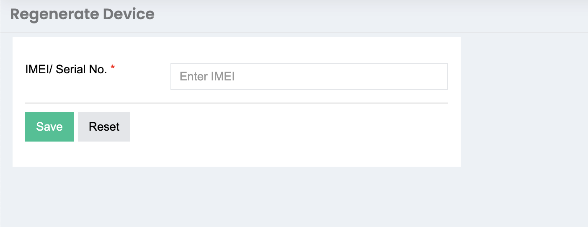

#### 🟦 1. Basic Information
| Field | Description |
| :--- | :--- |
| **Page ID:** | `P-034` |
| **Page Name:** | Regenerate Tracking Device |
| **Page Type:** | Utility / Action Form |
| **Page URL:** | `/en/frontdesk/tracking-device/regenerate` |
| **Purpose:** | To perform a "regenerate" action on an existing tracked device by looking it up via its IMEI or Serial Number. The exact nature of the "regenerate" action is not specified but could involve re-creating a label, resetting a status, or updating a record. |
| **Accessible by:**| Manager, Admin |
| **Note:** | The on-screen title is "Regenerate Device". |

---
#### 🟧 2. Input Fields
| # | Label | Field Name | Type | Required | Default | Behavior / Notes |
| :--- | :--- | :--- | :--- | :--- | :--- | :--- |
| 1 | **IMEI/ Serial No.** | `imei` | Text Input | Yes | Empty | The unique identifier of the device to be regenerated. Placeholder: "Enter IMEI". |

---
#### 🟩 4. Buttons & Actions
| Button Name | Type | Function / Behavior |
| :--- | :--- | :--- |
| **Save** | Submit | Finds the device by the provided IMEI and performs the "regenerate" action. |
| **Reset** | Reset | Clears the `IMEI/ Serial No.` input field. |

---
#### 🟦 5. Expected Outputs
* A success or error message is displayed to the user.
* The specific "regenerate" action is performed on the backend (e.g., a field is updated, a new label is generated, etc.).

---
#### 🟪 6. Validation Rules
| Field | Rule / Description | Error Message (Implied) |
| :--- | :--- | :--- |
| `imei` | Must not be empty. | This field is required. |
| `imei` | Must correspond to an existing device in the tracking system. | "Device with this IMEI not found." |

---
#### 🟫 7. Workflow
1.  User navigates to **Tracking Device > Regenerate Tracking Device**.
2.  The user enters the **IMEI/ Serial No.** of the device they want to affect.
3.  The user clicks the **"Save"** button.
4.  The system finds the device and performs the backend "regenerate" process, then provides feedback to the user.

---

---
[Back to Main Navigation Menu](#2-main-navigation-menu)

### Page: Tracking Device Brands

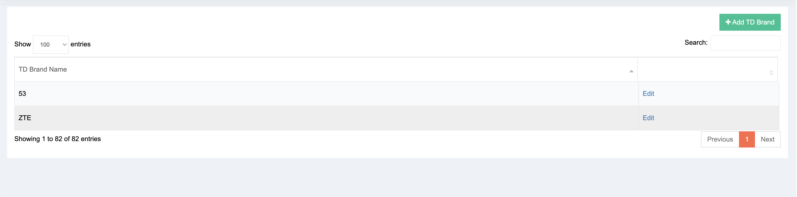

#### 🟦 1. Basic Information
| Field | Description |
| :--- | :--- |
| **Page ID:** | `P-035` |
| **Page Name:** | Tracking Device Brands |
| **Page Type:** | Master Data / List |
| **Page URL:** | `/en/frontdesk/voc/td_brand` (Inferred) |
| **Purpose:** | To create, view, search, and edit the list of brands that are specifically used for the "Tracking Device" module. |
| **Accessible by:**| Manager, Admin |

---
#### 🟨 3. Filters / Search
| Label | Field Name | Type | Logic | Notes |
| :--- | :--- | :--- | :--- | :--- |
| **Show Entries** | `vocab-data-table_length` | Dropdown | - | Changes the number of records displayed per page (e.g., 10 or 100). |
| **Search** | (Global Search) | Text Input | Contains | A global search field that filters all columns in the table in real-time as the user types. |

---
#### 🟩 4. Buttons & Actions
| Button Name | Type | Function / Behavior |
| :--- | :--- | :--- |
| **Add TD Brand** | Link / Button | Navigates to a form (likely `/en/frontdesk/voc/td_brand/add/nojs`) to create a new brand. |
| **Edit** | Link | Navigates to a form to modify the name of the selected brand. |

---
#### 🟦 5. Expected Outputs
* A paginated data table listing all defined brands for tracked devices.

**Table Columns**
| Column Header | Data Source | Notes |
| :--- | :--- | :--- |
| **TD Brand Name**| `name` | The name of the brand (e.g., "53", "ZTE"). |
| **(Actions)** | - | Contains the `Edit` link for each row. |

---
#### 🟫 7. Workflow
1.  User navigates to **Tracking Device > Brands**.
2.  The page loads displaying a list of all brands.
3.  The user can use the **Search** field to quickly find a specific brand.
4.  User can click **"Add TD Brand"** to create a new one.
5.  User can click **"Edit"** on an existing row to modify its name.

---
#### 🟧 8. Additional Notes / Integration
* This is a simple master data management page. The brands created here are used in the "Brand" dropdown on the "Add New Device" page within the Tracking Device module.

---

---
[Back to Main Navigation Menu](#2-main-navigation-menu)

### Page: Tracking Device Models

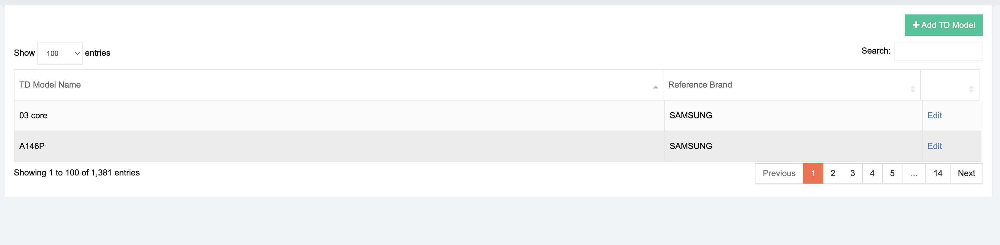

#### 🟦 1. Basic Information
| Field | Description |
| :--- | :--- |
| **Page ID:** | `P-036` |
| **Page Name:** | Tracking Device Models |
| **Page Type:** | Master Data / List |
| **Page URL:** | `/en/frontdesk/voc/td_model` (Inferred) |
| **Purpose:** | To create, view, search, and edit the list of device models that are specifically used for the "Tracking Device" module. |
| **Accessible by:**| Manager, Admin |
| **Note:** | The page title is blank, but the context is clear from the "Add TD Model" button and table headers. |

---
#### 🟨 3. Filters / Search
| Label | Field Name | Type | Logic | Notes |
| :--- | :--- | :--- | :--- | :--- |
| **Show Entries** | `vocab-data-table_length` | Dropdown | - | Changes the number of records displayed per page (e.g., 10 or 100). |
| **Search** | (Global Search) | Text Input | Contains | A global search field that filters all columns in the table in real-time as the user types. |

---
#### 🟩 4. Buttons & Actions
| Button Name | Type | Function / Behavior |
| :--- | :--- | :--- |
| **Add TD Model** | Link / Button | Navigates to a form (likely `/en/frontdesk/voc/td_model/add/nojs`) to create a new model and associate it with a brand. |
| **Edit** | Link | Navigates to a form to modify the name and brand association of the selected model. |

---
#### 🟦 5. Expected Outputs
* A paginated data table listing all defined models for tracked devices.

**Table Columns**
| Column Header | Data Source | Notes |
| :--- | :--- | :--- |
| **TD Model Name**| `name` | The name or identifier of the model (e.g., "D3 core"). |
| **Reference Brand**| `brand.name` | The brand this model is associated with (e.g., "SAMSUNG"). |
| **(Actions)** | - | Contains the `Edit` link for each row. |

---
#### 🟫 7. Workflow
1.  User navigates to **Tracking Device > Models**.
2.  The page loads displaying a list of all models and their associated brands.
3.  The user can use the **Search** field to quickly find a specific model.
4.  User can click **"Add TD Model"** to create a new one.
5.  User can click **"Edit"** on an existing row to modify it.

---
#### 🟧 8. Additional Notes / Integration
* This is a simple master data management page. The models created here are used in the "Model" dropdown on the "Add New Device" page within the Tracking Device module.
* Each model must be associated with a "Reference Brand" that exists on the "Tracking Device > Brands" page.

---

---
[Back to Main Navigation Menu](#2-main-navigation-menu)

## 9. Module: E-Commerce Dashboard

This module provides a dedicated interface for managing products sold on the e-commerce platform, separate from the in-store point-of-sale system.

### Page: Manage E-Commerce Products

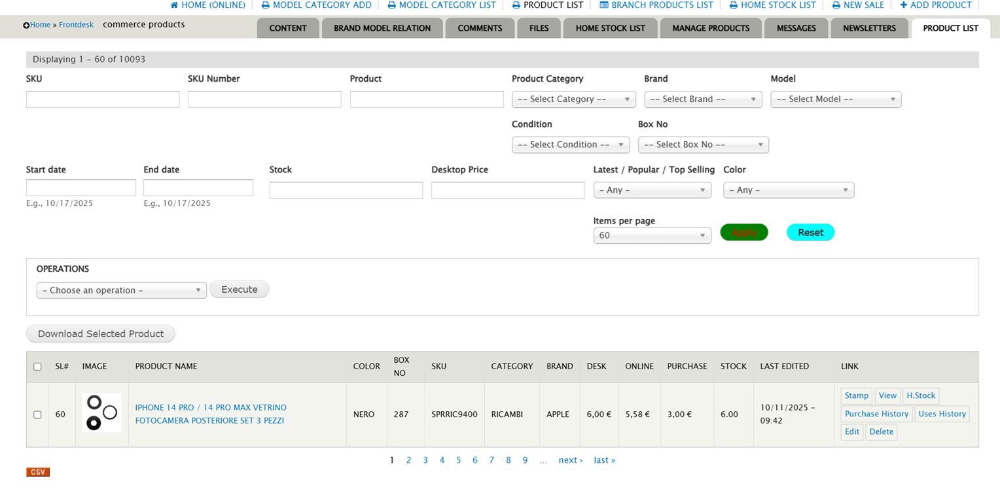

#### 🟦 1. Basic Information
| Field | Description |
| :--- | :--- |
| **Page ID:** | `P-037` |
| **Page Name:** | Manage E-Commerce Products |
| **Page Type:** | Dashboard / Search / List |
| **Page URL:** | `/en/admin/content/commerce-products` |
| **Purpose:** | To serve as the central hub for managing all e-commerce products, providing extensive filtering, bulk operations, and quick access to individual product details. |
| **Accessible by:**| Manager, Admin |
| **Note:** | The on-screen title is "Displaying 1 - 60 of 10093". The primary tab is "MANAGE PRODUCTS". |

---
#### 🟨 3. Filters / Search
The page features a powerful, multi-field search form to locate specific products.

| Label | Field Name | Type | Logic | Notes |
| :--- | :--- | :--- | :--- | :--- |
| **SKU** | `sku` | Text Input | Contains | Filters by the product's Stock Keeping Unit. |
| **SKU Number** | `sku_number` | Text Input | Contains | A secondary SKU field for filtering. |
| **Product** | `product` | Text Input | Contains | Searches by the product's name. |
| **Product Category** | `category` | Dropdown | Exact Match | Filters by the assigned product category. |
| **Brand** | `brand` | Dropdown | Exact Match | |
| **Model** | `model` | Dropdown | Exact Match | Dependent on the selected brand. |
| **Condition** | `condition` | Dropdown | Exact Match | e.g., "New", "Used". |
| **Box No** | `box_no` | Dropdown | Exact Match | Filters by the assigned storage box number. |
| **Start Date / End Date** | `start_date`, `end_date` | Date Pickers | Date Range | Filters by the product's creation or last edited date. |
| **Stock** | `stock` | Text Input | Contains / Exact Match | Filters by the current stock level. |
| **Desktop Price** | `desktop_price` | Text Input | Contains / Exact Match | |
| **Latest / Popular / Top Selling** | `meta_tags` (Assumed) | Dropdown | Exact Match | Filters by marketing tags assigned to products. |
| **Color** | `color` | Dropdown | Exact Match | |
| **items per page** | `items_per_page` | Dropdown | - | Controls pagination for the results. |

---
#### 🟩 4. Buttons & Actions
| Button Name | Type | Function / Behavior |
| :--- | :--- | :--- |
| **Search** | Submit Button | (Labeled "Filter") Applies the filter criteria and updates the product list. |
| **Reset** | Reset Button | Clears all filter fields. |
| **Execute** | Submit Button | Applies the selected bulk "OPERATIONS" to all checked products in the list. |
| **CSV** | Link | Exports the current view of the product list to a CSV file. |
| **(Action Links)**| Links | Each product row has links for `Stamp` (Barcode), `View`, `Purchase History`, `Edit`, and `Delete`. |

---
#### 🟦 5. Expected Outputs
* A paginated data table showing all e-commerce products that match the filter criteria.
* Each product row has a checkbox (`SL#`) for selecting it for bulk operations.

**Table Columns**
| Column Header | Data Source | Notes |
| :--- | :--- | :--- |
| **SL#** | - | Checkbox for bulk selection. |
| **IMAGE** | `productImage` | A thumbnail of the product. |
| **PRODUCT NAME** | `productName` | |
| **COLOR** | `color.name` | |
| **SKU** | `sku` | |
| **CATEGORY** | `category.name` | |
| **BRAND** | `brand.name` | |
| **DESK** | `desktopPrice` | In-store price. |
| **ONLINE** | `onlinePrice` | E-commerce price. |
| **PURCHASE** | `purchasePrice` | Cost price. |
| **STOCK** | `stock` | Current inventory level. |
| **LAST EDITED** | `lastEdited` | Timestamp of the last modification. |
| **LINK** | - | Contains the action links for the row. |

---
#### 🟫 7. Workflow
1.  User navigates to the **E-Commerce Dashboard**.
2.  The page loads displaying a list of all products.
3.  User can apply various filters to find specific products.
4.  User clicks the **"Filter"** button to see the results.
5.  **For bulk operations:** User checks the boxes next to multiple products, selects an action from the "OPERATIONS" dropdown (e.g., "Download Selected Product"), and clicks **"Execute"**.
6.  **For single product actions:** User clicks an action link like `Edit` or `Delete` on a specific product row.

---

---
[Back to Main Navigation Menu](#2-main-navigation-menu)

### Page: Add Product

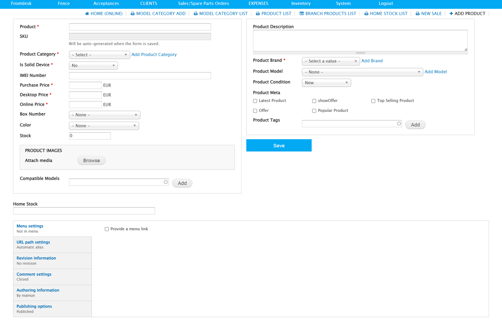

#### 🟦 1. Basic Information
| Field | Description |
| :--- | :--- |
| **Page ID:** | `P-038` |
| **Page Name:** | Add Product (E-Commerce) |
| **Page Type:** | Create Form |
| **Page URL:** | `/en/node/add/product-display` |
| **Purpose:** | To create a new, detailed product listing for the e-commerce platform, including pricing, stock, images, and descriptive metadata. |
| **Accessible by:**| Manager, Admin |

---
#### 🟧 2. Input Fields
| # | Label | Field Name | Type | Required | Default | Behavior / Notes |
| :--- | :--- | :--- | :--- | :--- | :--- | :--- |
| 1 | **Product** | `title` | Text Input | Yes | Empty | The main name of the product. |
| 2 | **SKU** | `sku` | Text (Read-only) | - | "Will be auto-generated..." | The Stock Keeping Unit is generated by the system after the form is saved. |
| 3 | **Product Category** | `product_category_tid` | Dropdown | Yes | `- Select -` | `+ Add Product Category` link opens a modal to create a new category. |
| 4 | **Is Solid Device?** | `is_solid_device` | Dropdown (Yes/No) | Yes | No | Distinguishes parts/accessories from whole devices. |
| 5 | **IMEI Number** | `imei_number` | Text Input | No | Empty | For tracking individual serialized devices. |
| 6 | **Purchase Price** | `purchase_price` | Number | Yes | Empty | The cost to acquire the product. |
| 7 | **Desktop Price** | `desktop_price` | Number | Yes | Empty | The in-store selling price. |
| 8 | **Online Price** | `online_price` | Number | Yes | Empty | The e-commerce selling price. |
| 9 | **Box Number** | `box_number_tid` | Dropdown | No | `- None -` | The physical storage location of the product. |
| 10 | **Color** | `color_tid` | Dropdown | No | `- None -` | The product's color. |
| 11 | **Stock** | `stock` | Number | No | `0` | The initial inventory quantity for this product. |
| 12 | **PRODUCT IMAGES** | `product_images` | File Upload | No | - | Allows attaching media/images to the product. |
| 13 | **Compatible Models**| `compatible_models` | Autocomplete Text | No | Empty | Allows adding multiple compatible models to the product listing. |
| 14 | **Home Stock** | `home_stock` | Text Input | No | Empty | A separate stock count for a specific location. |
| 15 | **Product Description**| `description` | Text Area | No | Empty | A detailed description of the product for the e-commerce site. |
| 16 | **Product Brand** | `brand_tid` | Dropdown | Yes | `- Select a value -` | `+ Add Brand` link opens a modal to create a new brand. |
| 17 | **Product Model** | `model_tid` | Dropdown | No | `- None -` | Dependent on the selected brand. `+ Add Model` link to create a new model. |
| 18 | **Product Condition**| `condition` | Dropdown | No | `New` | e.g., "New", "Used". |
| 19 | **Product Meta** | `meta_tags[]` | Checkboxes | No | None checked | Marketing flags like "Latest Product", "showOffer", "Top Selling Product", "Popular Product". |
| 20 | **Product Tags** | `tags` | Autocomplete Text | No | Empty | Allows adding multiple descriptive tags to the product. |

---
#### 🟩 4. Buttons & Actions
| Button Name | Type | Function / Behavior |
| :--- | :--- | :--- |
| **Save** | Submit | Validates and saves the new product, generating an SKU in the process. |
| **Add** | Button | For "Compatible Models" and "Product Tags", this button adds the entered text to a list for that field. |
| **Browse** | Button | For "PRODUCT IMAGES", opens the file selection dialog. |

---
#### 🟦 5. Expected Outputs
1.  A new **E-Commerce Product** record is created in the database.
2.  The system auto-generates and assigns a unique **SKU** to the new product.
3.  The user is redirected to the **Manage E-Commerce Products** list page.
4.  A success message is displayed.

---
#### 🟪 6. Validation Rules
| Field | Rule / Description | Error Message (Implied) |
| :--- | :--- | :--- |
| `Product` | Must not be empty. | This field is required. |
| `Product Category`| Must be selected. | This field is required. |
| `Is Solid Device?`| Must be selected. | This field is required. |
| `Purchase Price`| Must not be empty and must be a valid number. | This field is required. |
| `Desktop Price`| Must not be empty and must be a valid number. | This field is required. |
| `Online Price`| Must not be empty and must be a valid number. | This field is required. |
| `Product Brand`| Must be selected. | This field is required. |

---
#### 🟫 7. Workflow
1.  User navigates to **E-Commerce Dashboard** and clicks the **"+ ADD PRODUCT"** tab.
2.  User fills out all required product information, including name, category, brand, and pricing.
3.  User adds optional details like images, compatible models, and marketing tags.
4.  User clicks the **"Save"** button.
5.  The system validates the form, creates the product, generates an SKU, and redirects the user back to the product list.

---
#### 🟧 8. Additional Notes / Integration
* The form includes several CMS-specific sections at the bottom (`Menu settings`, `URL path settings`, `Revision information`, etc.) that control how the product page is published and displayed on the website. These are standard features in systems like Drupal.

---

---
[Back to Main Navigation Menu](#2-main-navigation-menu)

### Page: Home Stock List

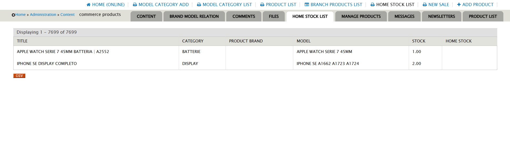

#### 🟦 1. Basic Information
| Field | Description |
| :--- | :--- |
| **Page ID:** | `P-039` |
| **Page Name:** | Home Stock List |
| **Page Type:** | Report / List |
| **Page URL:** | `/en/admin/content/commerce-product-stock` |
| **Purpose:** | To provide a simple, direct view of product inventory levels, specifically comparing the general "Stock" count with a separate "Home Stock" count for each product. |
| **Accessible by:**| Manager, Admin |

---
#### 🟨 3. Filters / Search
* **Note:** This page does not have any interactive filter fields. It displays a complete list of all products with their stock information.

---
#### 🟩 4. Buttons & Actions
| Button Name | Type | Function / Behavior |
| :--- | :--- | :--- |
| **Download CSV** | Link / Button | Exports the entire list of products and their stock levels to a CSV file for offline analysis or record-keeping. |

---
#### 🟦 5. Expected Outputs
* A paginated data table that lists all products and their corresponding stock levels.

**Table Columns**
| Column Header | Data Source | Notes |
| :--- | :--- | :--- |
| **Title** | `productName` | The name of the product. |
| **Category** | `category.name` | The product's category. |
| **Product Brand** | `brand.name` | The brand of the product. |
| **Model** | `model.name` | The model of the product. |
| **Stock** | `stock` | The main inventory level. |
| **Home Stock** | `homeStock` | A separate, specific stock count (e.g., for a central warehouse). |

---
#### 🟫 7. Workflow
1.  User navigates to **E-Commerce Dashboard > Home Stock List**.
2.  The page loads, displaying a complete list of all products and their stock counts.
3.  User can optionally click the **"Download CSV"** button to export the data.

---
#### 🟧 8. Additional Notes / Integration
* This page is a read-only report designed for quick inventory overview and export. It does not allow for editing data directly.
* The primary function is to compare the general stock with a specific "Home Stock" location.

---

---
[Back to Main Navigation Menu](#2-main-navigation-menu)

## 10. Module: Home

This module represents the main landing pages and dashboards of the application.

### Page: Frontdesk

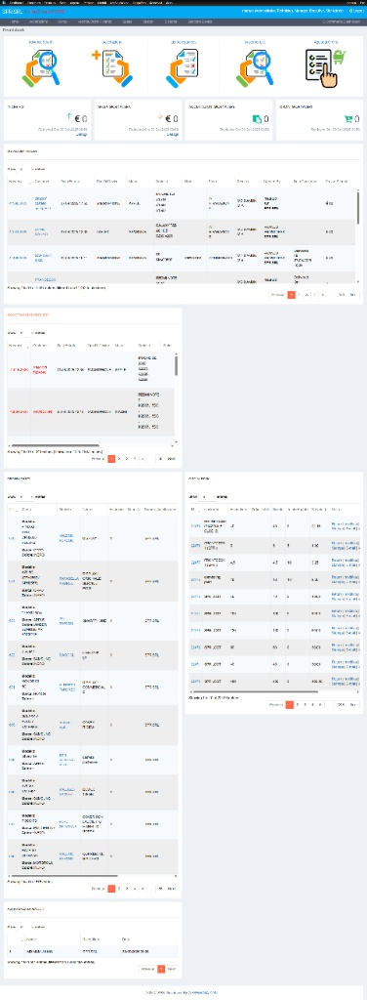

#### 🟦 1. Basic Information
| Field | Description |
| :--- | :--- |
| **Page ID:** | `P-040` |
| **Page Name:** | Frontdesk |
| **Page Type:** | Dashboard |
| **Page URL:** | `/en/frontdesk` (or the root `/`) |
| **Purpose:** | To provide a high-level, at-a-glance overview of the business's current status, focusing on repair job statistics and recent activities. This is the primary landing page for most users after login. |
| **Accessible by:**| All authenticated users |

---
#### 🟦 5. Expected Outputs
This page consists of several widgets and data tables that summarize the state of the repair jobs in the system.

**A. Summary Widgets**
A row of four main statistical panels at the top of the page.

| Widget Title | Calculation / Data Source |
| :--- | :--- |
| **Today's Jobs** | COUNT of all `Jobs` where `createdDate` is today. |
| **Total Pending Jobs** | COUNT of all `Jobs` where the status is not "Completed" or "Delivered". |
| **Total Jobs of the Month**| COUNT of all `Jobs` where `createdDate` is in the current month. |
| **Total Jobs of the Year**| COUNT of all `Jobs` where `createdDate` is in the current year. |

**B. Data Tables**
Four distinct tables providing lists of recent or pending jobs.

1.  **Latest 10 Jobs:**
    * **Content:** A list of the 10 most recently created repair jobs.
    * **Columns:** `Number`, `Customer`, `Created Date`, `Status`.

2.  **Latest 10 Delivered Jobs:**
    * **Content:** A list of the 10 most recently delivered repair jobs.
    * **Columns:** `Number`, `Customer`, `Created Date`, `Delivery Date`.

3.  **Jobs Waiting for Parts:**
    * **Content:** A list of all jobs currently on hold with a status indicating they are waiting for spare parts.
    * **Columns:** `Number`, `Customer`, `Created Date`, `Technician`.

4.  **Pending Jobs by Technician:**
    * **Content:** A summary showing the count of pending jobs for each technician.
    * **Columns:** `(Serial #)`, `Technician Name`, `Total Pending`.

---
#### 🟫 7. Workflow
1.  User logs into the system.
2.  The user is automatically directed to the **Frontdesk** dashboard.
3.  The user can view the key performance indicators in the top widgets.
4.  The user can review the various lists to see recent activity and current bottlenecks (like jobs waiting for parts).
5.  The user can click on an `Acceptance Number` in any of the tables to navigate directly to the "Edit Acceptance" page for that job.

---
#### ⚙️ 11. Backend Instruction / Guide
* The backend needs to provide multiple endpoints to populate this dashboard efficiently.
* One endpoint for the four widget counts (e.g., `/api/dashboard/stats`).
* Separate endpoints for each of the four tables, each performing a specific query:
    * `Latest Jobs`: `SELECT ... FROM jobs ORDER BY createdDate DESC LIMIT 10`
    * `Delivered Jobs`: `SELECT ... FROM jobs WHERE status = 'Delivered' ORDER BY deliveryDate DESC LIMIT 10`
    * `Waiting for Parts`: `SELECT ... FROM jobs WHERE status = 'Waiting for Parts'`
    * `Pending by Technician`: `SELECT technician_id, COUNT(*) FROM jobs WHERE status = 'Pending' GROUP BY technician_id`

---

---
[Back to Main Navigation Menu](#2-main-navigation-menu)

### Page: Branches (Search)

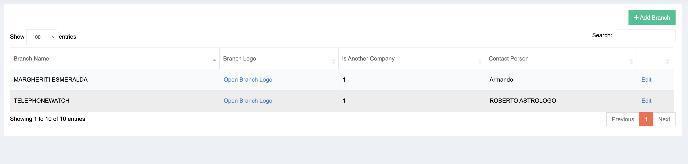

#### 🟦 1. Basic Information
| Field | Description |
| :--- | :--- |
| **Page ID:** | `P-041` |
| **Page Name:** | Branches (Search) |
| **Page Type:** | Master Data / List |
| **Page URL:** | `/en/frontdesk/voc/branch` (Inferred) |
| **Purpose:** | To manage the list of all company branches or associated entities. This includes adding new branches, editing existing ones, and viewing their details. |
| **Accessible by:**| Admin |

---
#### 🟨 3. Filters / Search
| Label | Field Name | Type | Logic | Notes |
| :--- | :--- | :--- | :--- | :--- |
| **Show Entries** | `vocab-data-table_length` | Dropdown | - | Changes the number of records displayed per page (e.g., 10 or 100). |
| **Search** | (Global Search) | Text Input | Contains | A global search field that filters all columns in the table as the user types. |

---
#### 🟩 4. Buttons & Actions
| Button Name | Type | Function / Behavior |
| :--- | :--- | :--- |
| **Add Branch** | Link / Button | Navigates to the form for creating a new branch. |
| **Edit** | Link | Navigates to the edit page for the selected branch. |
| **Open Branch Logo**| Link | Opens the branch's logo image in a new tab. |

---
#### 🟦 5. Expected Outputs
* A paginated data table listing all configured branches.

**Table Columns**
| Column Header | Data Source | Notes |
| :--- | :--- | :--- |
| **Branch Name** | `name` | The official name of the branch. |
| **Branch Logo** | `logo_url` | A link to view the uploaded logo for the branch. |
| **Is Another Company** | `is_another_company` | A boolean flag (represented as 1 or 0) to distinguish external partners from internal branches. |
| **Contact Person**| `contact_person` | The name of the primary contact for that branch. |
| **(Actions)** | - | Contains the `Edit` link for the row. |

---
#### 🟫 7. Workflow
1.  User navigates to **Options > Branches > Search**.
2.  The page loads with a list of all existing branches.
3.  User can use the **Search** box to filter the list by name, contact person, etc.
4.  User clicks **"Add Branch"** to navigate to the creation page.
5.  User clicks **"Edit"** on a specific row to modify that branch's details.

---
#### 🟧 8. Additional Notes / Integration
* This is a core master data page. The branches defined here populate dropdown menus across the entire application, including on the "Add User", "Add Customer", and "Add Expense" forms.

---

---
[Back to Main Navigation Menu](#2-main-navigation-menu)

### Page: Add Branch

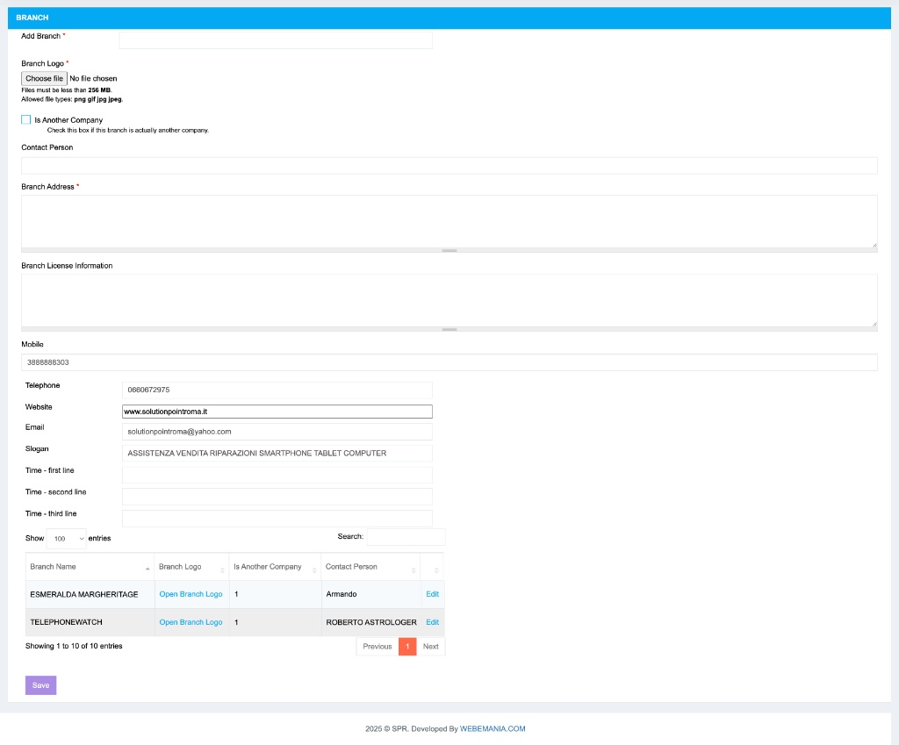

#### 🟦 1. Basic Information
| Field | Description |
| :--- | :--- |
| **Page ID:** | `P-042` |
| **Page Name:** | Add Branch |
| **Page Type:** | Create Form |
| **Page URL:** | `/en/frontdesk/voc/branch/add/nojs` |
| **Purpose:** | To create a new record for an internal branch or an external partner company, including its contact details, address, and logo. |
| **Accessible by:**| Admin |

---
#### 🟧 2. Input Fields
| # | Label | Field Name | Type | Required | Default | Behavior / Notes |
| :--- | :--- | :--- | :--- | :--- | :--- | :--- |
| 1 | **Add Branch** | `name` | Text Input | Yes | Empty | The name of the new branch or company. |
| 2 | **Branch Logo** | `files[field_image_und_0]` | File Upload | Yes | - | Allows uploading a logo image. |
| 3 | **Is Another Company**| `field_is_another_company[und]`| Checkbox | No | Unchecked | If checked, it flags this entry as an external partner rather than an internal branch. |
| 4 | **Contact Person** | `field_contact_person[und][0][value]` | Text Input | No | Empty | |
| 5 | **Branch Address** | `field_branch_address[und][0][value]` | Text Area | Yes | Empty | |
| 6 | **Branch License Information**| `field_branch_license_information[und][0][value]` | Text Area | No | Empty | |
| 7 | **Mobile** | `field_mobile[und][0][value]` | Text Input | No | `3888888303` | |
| 8 | **Telephone** | `field_phone[und][0][value]` | Text Input | No | `0660672975` | |
| 9 | **Website** | `field_website[und][0][url]` | URL Input | No | `www.solutionpointroma.it` | |
| 10| **Email** | `field_email[und][0][value]` | Email Input | No | `solutionpointroma@yahoo.com` | |
| 11| **Slogan** | `field_slogan[und][0][value]` | Text Input | No | `ASSISTENZA VENDITA RIPARAZIONI...`| |
| 12| **Time - first line** | `field_weekdays_time_one[und][0][value]` | Text Input | No | Empty | For displaying operating hours. |
| 13| **Time - second line**| `field_weekdays_time_two[und][0][value]` | Text Input | No | Empty | For displaying operating hours. |
| 14| **Time - third line** | `field_sabato_time_one[und][0][value]` | Text Input | No | Empty | For displaying operating hours. |

---
#### 🟩 4. Buttons & Actions
| Button Name | Type | Function / Behavior |
| :--- | :--- | :--- |
| **Save** | Submit | Validates the form and saves the new branch record. |

---
#### 🟦 5. Expected Outputs
1.  A new **Branch** record is created in the database.
2.  The user is redirected to the **Branches (Search)** list page.
3.  The new branch appears in the table that is also displayed at the bottom of this page.
4.  A success message is shown.

---
#### 🟪 6. Validation Rules
| Field | Rule / Description | Error Message (Implied) |
| :--- | :--- | :--- |
| `name` | Must not be empty. | This field is required. |
| `files[field_image_und_0]`| A file must be uploaded. | This field is required. |
| `field_branch_address[und][0][value]`| Must not be empty. | This field is required. |

---
#### 🟫 7. Workflow
1.  User navigates to **Options > Branches > Add Branch**.
2.  The page loads with the creation form at the top and the list of existing branches at the bottom.
3.  The user fills in all required details for the new branch.
4.  The user clicks the **"Save"** button.
5.  The system creates the record and refreshes the page, showing the new branch in the list below the form.

---
#### 🟧 8. Additional Notes / Integration
* Like the "Add Supplier" page, the creation form is displayed directly above the list of existing entries.

---

---
[Back to Main Navigation Menu](#2-main-navigation-menu)

### Page: Branch Products List

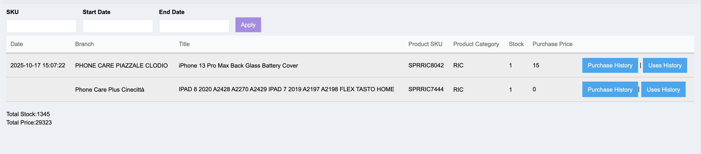

#### 🟦 1. Basic Information
| Field | Description |
| :--- | :--- |
| **Page ID:** | `P-043` |
| **Page Name:** | Branch Products List |
| **Page Type:** | Report / List |
| **Page URL:** | `/en/frontdesk/branch-products-list/all` |
| **Purpose:** | To view a list of all product stock across all branches, with simple filtering options and links to view historical data for each item. |
| **Accessible by:**| Manager, Admin |

---
#### 🟨 3. Filters / Search
| Label | Field Name | Type | Logic | Notes |
| :--- | :--- | :--- | :--- | :--- |
| **SKU** | `sku` | Text Input | Contains | Filters the list by the product's SKU. |
| **Start Date** | `updated_date` | Date Picker | Greater than or equal to | Filters products based on their creation or last update date. |
| **End Date** | `updated_date_1` | Date Picker | Less than or equal to | |

---
#### 🟩 4. Buttons & Actions
| Button Name | Type | Function / Behavior |
| :--- | :--- | :--- |
| **Apply** | Submit Button | Executes the search based on the filter criteria. |
| **Purchase History** | Link | Opens a modal or new page showing the purchase history for that specific product SKU. |
| **Uses History** | Link | Opens a modal or new page showing where that product SKU has been used (e.g., in which repair jobs or sales). |

---
#### 🟦 5. Expected Outputs
* A data table listing all products across all branches that match the filter criteria.
* A summary footer displaying the "Total Stock" and "Total Price" (total value of stock based on purchase price) for the items listed.

**Table Columns**
| Column Header | Data Source | Notes |
| :--- | :--- | :--- |
| **Date** | `date` | The timestamp of the last update to the product record. |
| **Branch** | `branch.name` | The branch where the product is located. |
| **Title** | `title` | The name of the product. |
| **Product SKU** | `sku` | The unique identifier for the product. |
| **Product Category** | `category.name` | |
| **Stock** | `stock` | The current inventory level for that product at that branch. |
| **Purchase Price** | `purchasePrice` | The cost of the product. |

---
#### 🟫 7. Workflow
1.  User navigates to **Home > Branch Products List**.
2.  The page loads displaying a list of product stock across all branches.
3.  The user can filter the list by `SKU` or a `Date Range` and click **"Apply"**.
4.  For any product in the list, the user can click **"Purchase History"** or **"Uses History"** to see detailed reports for that specific item.

---

---
[Back to Main Navigation Menu](#2-main-navigation-menu)